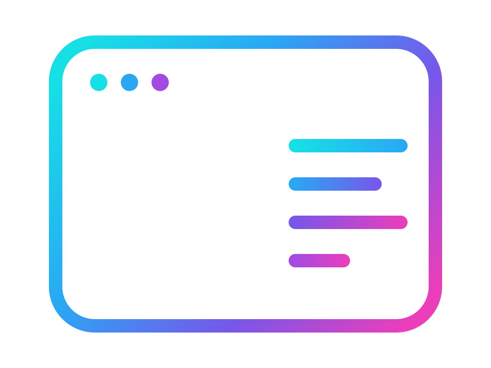

# tuil

<p align="center">
  
</p>

<p align="center">
  <strong>Terminal UI, without the runtime tax.</strong><br />
  A production-ready React and Ink framework for composable terminal applications.
</p>

<p align="center">
  <a href="https://www.npmjs.com/package/@mwillbanks/tuil"></a>
  <a href="https://github.com/mwillbanks/tuil/actions/workflows/ci.yml"></a>
  <a href="https://app.codecov.io/gh/mwillbanks/tuil"></a>
  <a href="LICENSE"></a>
</p>

tuil combines an application runtime, Ink rendering, typed forms and routes,
focus and hotkey management, cancellable operations, persistent workflows,
plugins, themes, source-owned components, portable stories, and semantic
testing. Applications share one set of runtime contracts across interactive
terminals, redirected output, tests, documentation, and Storybook.

**[Read the documentation](https://mwillbanks.github.io/tuil/)**

## Why tuil

| Capability | What it provides |
| --- | --- |
| Application runtime | Explicit services, lifecycle, capabilities, commands, events, and teardown |
| Terminal-native UX | Focus scopes, hotkey sequences, overlays, forms, routing, and responsive layouts |
| Deterministic output | Interactive, static, text, silent, and JSON modes from the same application |
| Portable stories | One catalog for live previews, Storybook, snapshots, and generated documentation |
| Semantic testing | Query roles and labels instead of brittle terminal coordinates |
| Source ownership | Install inspectable components and blocks through the registry CLI |

## Install

Install the framework, Ink adapter, renderer, and React:

```npm
npm install @mwillbanks/tuil @mwillbanks/tuil-ink ink react
```

Create a project with the self-hosted initializer:

```npm
npx @mwillbanks/tuil init
```

The initializer validates the destination before writing and can install
registry components and bundled Agent Skills alongside the generated
application.

## Ecosystem

- `@mwillbanks/tuil` — application creation, runtime services, and the CLI
- `@mwillbanks/tuil-ink` — Ink rendering, input, semantics, and overlays
- `@mwillbanks/tuil-form` — typed forms, validation, and controlled fields
- `@mwillbanks/tuil-router` — typed routes, guards, history, and layouts
- `@mwillbanks/tuil-operations` — observable asynchronous work and cancellation
- `@mwillbanks/tuil-workflow` — persistent, resumable multi-step workflows
- `@mwillbanks/tuil-plugin` — dependency-aware plugin lifecycle
- `@mwillbanks/tuil-theme` — tokens, variants, utilities, and theme registries
- `@mwillbanks/tuil-testing` — portable stories and semantic assertions
- `@mwillbanks/tuil-testing-ink` — Ink-backed application test rendering
- `@mwillbanks/tuil-story` — browser, Storybook, snapshot, and docs adapters

The complete package map, architecture, component registry, examples, skills,
and migration guidance live in the
[documentation](https://mwillbanks.github.io/tuil/).

## Development

Bun 1.3.14 or newer is required.

```npm
bun install --frozen-lockfile
bun run check
bun run docs
```

`bun run check` validates formatting and types, runs coverage-gated tests,
builds every publication artifact, and audits the project with Fallow. Run the
dependency security gate separately:

```npm
bun run security
```

See [CONTRIBUTING.md](CONTRIBUTING.md) for the complete workflow and pull
request expectations.

## Security

Do not report vulnerabilities in a public issue. Follow
[SECURITY.md](SECURITY.md) to submit a private GitHub Security Advisory.

## License

MIT
