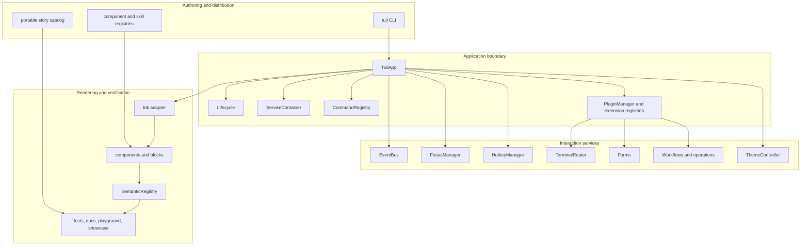
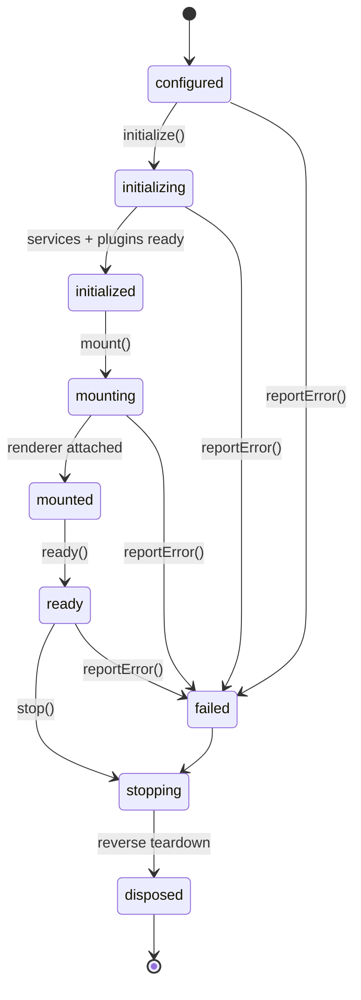
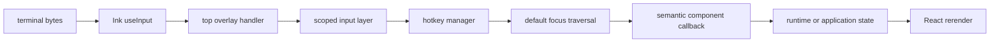
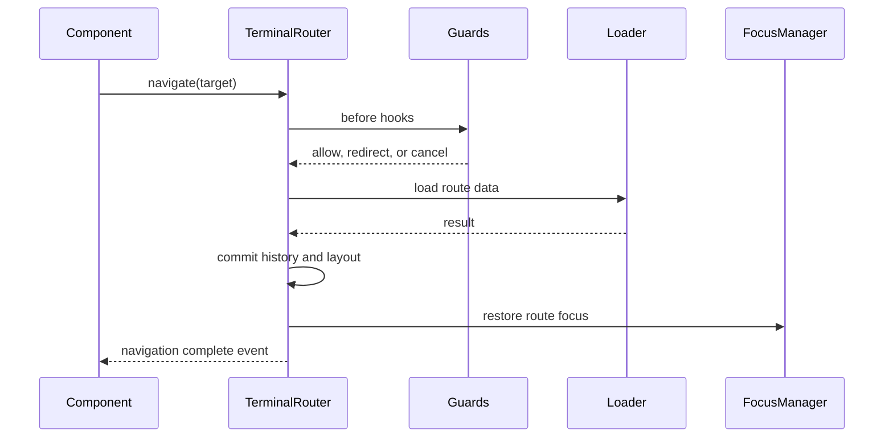

## System layers

The `TuilApp` instance is the ownership root. It constructs runtime services,
registers plugins, exposes typed extension registries, and disposes resources in
reverse ownership order.

## Application lifecycle

Every stage has a matching `app:*` event. Errors are reported through
`app:error`, then the configured error handler. Teardown is idempotent so error
paths and normal exit share the same ownership rules.

## Input flow

The first consumer that handles input stops the chain. Active overlays suppress
application hotkeys, and input errors flow to `app.reportError()` instead of
escaping through an unobserved promise.

## Navigation flow

## Ownership rules

- `TuilApp` owns core services, plugins, event definitions, and extension
  registries.
- Providers own React subscriptions and unregister on unmount.
- Every runtime registration returns a disposer.
- Plugins deactivate and dispose in reverse dependency order.
- Workflow runners and operation executors own abort controllers and observers.
- Stories and tests always close render sessions, even after a failed action.

See [Events](./events), [Extensibility](./extensibility), and the
[package reference](/docs/reference/packages) for the concrete contracts.
