Events are declared before emission. This keeps plugin and application event
maps type-safe and gives observers a single redaction boundary.

```tsx
const events = defineEvents({
  "task:started": event<{ taskId: string }>(),
  "credential:used": event<{ token: string }>({
    redact: () => ({ token: "[redacted]" }),
  }),
});
```

## Core application events

| Event | Meaning |
| --- | --- |
| `app:configure` | The application boundary and definitions exist. |
| `app:initialize` | Services and plugins are initializing. |
| `app:mount` | The renderer is attaching. |
| `app:ready` | The application accepts normal interaction. |
| `app:error` | A runtime phase reported an error. |
| `app:stop` | Teardown has started. |
| `app:dispose` | Owned resources are disposed. |

## Dispatch flow

```mermaid
flowchart LR
  Emit["emit(type, payload)"] --> Validate["definition exists"]
  Validate --> Schedule["priority scheduling"]
  Schedule --> Capture["capture path"]
  Capture --> Target["target"]
  Target --> Bubble["bubble path"]
  Bubble --> Redact["redact observed payload"]
  Redact --> History["bounded history"]
  History --> Observers["diagnostics and devtools"]
```



`preventDefault()` records that default behavior should not run.
`stopPropagation()` ends the remaining routed phases. Subscription priority
orders listeners within the same phase; event priority controls scheduling.

## Priorities

- `immediate`: lifecycle and safety-sensitive work
- `interaction`: direct user intent
- `normal`: ordinary application updates
- `background`: work that may yield before dispatch

## Subscription ownership

`on()` and `observe()` return disposers. Pass an `AbortSignal` when the
subscription belongs to a request, workflow step, plugin activation, or React
effect so cancellation and disposal share the same boundary.

Workflow and router event vocabularies are listed in their
[package pages](/docs/reference/packages).
