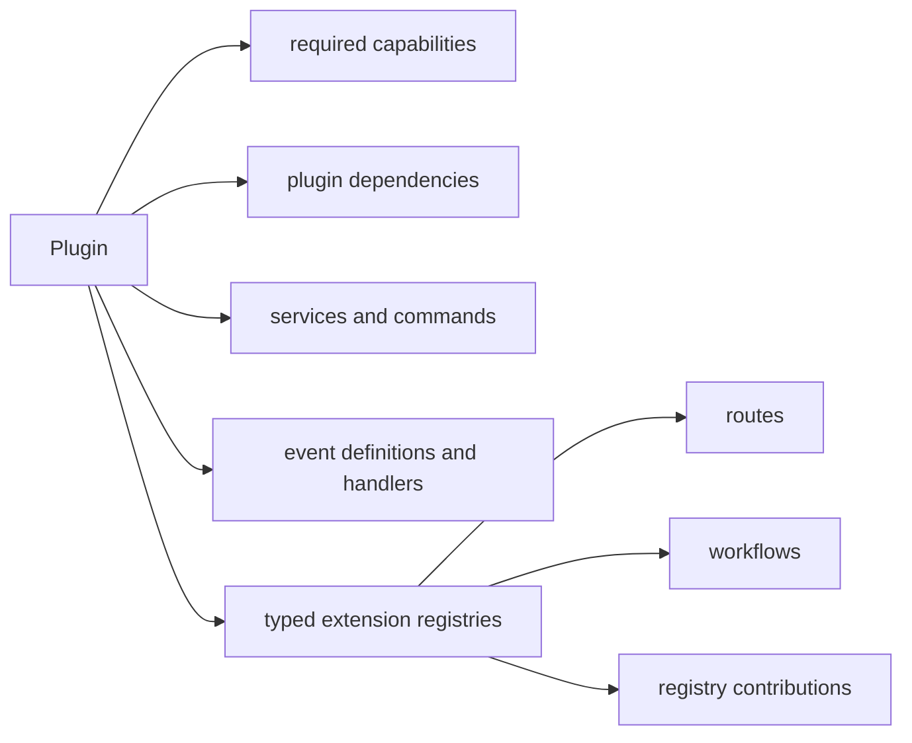

Plugins extend one application without replacing its ownership boundary.

Each extension registration tracks registration identity rather than value
identity. The same object may be registered more than once and each registration
can be observed or disposed independently.

Plugins resolve in dependency order and tear down in reverse order. A failure
during registration or activation rolls back already-owned resources.

Continue with [Authoring plugins](/docs/guides/authoring-plugins).
