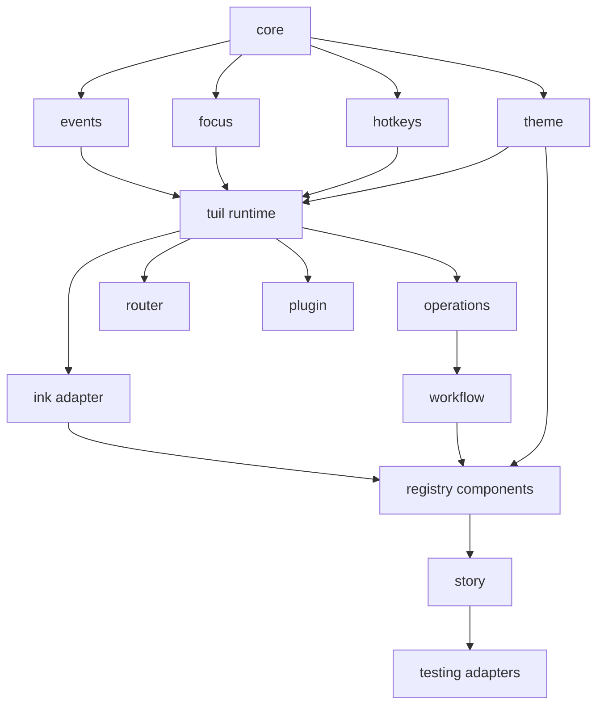

## Dependency direction

Install `@mwillbanks/tuil` for the integrated application boundary. Install
focused packages when building an adapter, plugin, test harness, or reusable
library that should not depend on the full runtime.

The [package reference](/docs/reference/packages) is generated from current
source declarations and adds an operational model, lifecycle, events, and
example for every workspace package.
