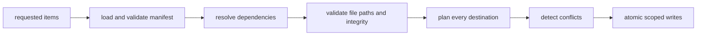

The registry distributes source files, not opaque runtime widgets. Applications
can inspect and customize installed components while sharing package-level
contracts.

## Install flow

Remote sources reject unsupported schemes, credentials in URLs, query or
fragment ambiguity, unsafe relative paths, and invalid package or dependency
metadata. Plain HTTP is limited to explicit loopback development hosts.

See [Custom registries](/docs/guides/custom-registries) and the
[`@mwillbanks/tuil-registry` reference](/docs/reference/packages/registry).
