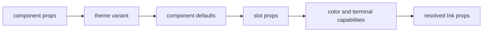

Themes are data, not global terminal mutations. A normalized theme contains
color and spacing tokens, component defaults, variants, slots, and capability
requirements.

```tsx
const ocean = createTheme({
  id: "ocean",
  colors: {
    foreground: "#eafcff",
    background: "#071014",
    primary: "#16e0e6",
  },
});
```

## Resolution



`ThemeController` is the live state owner. React consumers subscribe with
`useSyncExternalStore`, so theme updates are tear-free and observable outside
React. Static `ThemeProvider` usage remains available for isolated rendering and
tests.

Use [Theme customization](/docs/guides/theme-customization) for an end-to-end
example.
