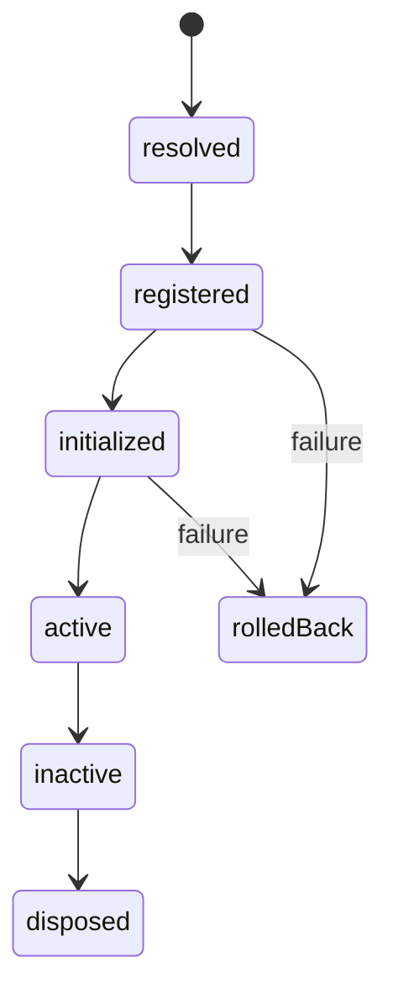

```tsx
const analytics = createPlugin({
  id: "analytics",
  capabilities: ["events"],
  register(context) {
    const disposeRoute = context.extensions.routes.register({
      id: "analytics",
    });
    return () => disposeRoute();
  },
  activate(context) {
    return context.events.observe((event) => track(event));
  },
});
```

## Rules

- IDs are stable and unique.
- Dependencies name other plugins; capabilities name host features.
- Registration creates definitions and extension contributions.
- Activation starts behavior after all dependencies are registered.
- Every hook returns or owns its teardown.
- Health reporting must not mutate application state.


