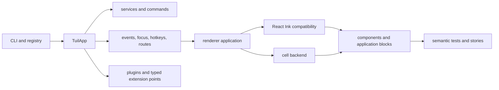

tuil is a renderer-neutral framework for terminal applications that need more
than rendered text. It supports existing React Ink components and direct
renderer applications on the deterministic cell backend while coordinating
lifecycle, typed events, services, commands, focus, hotkeys, routes, forms,
workflows, operations, themes, plugins, source-owned components, semantic
tests, and portable stories.

## Choose a path

<Cards>
  <Card title="Build your first app" href="/docs/introduction/quick-start">
    Scaffold a project with the CLI, run it, and understand the generated
    runtime boundary.
  </Card>
  <Card title="Understand the architecture" href="/docs/concepts/architecture">
    Follow ownership and data flow from the application runtime to terminal
    rendering.
  </Card>
  <Card title="Browse packages" href="/docs/reference/packages">
    Inspect every package, export, lifecycle contract, event surface, and
    focused example.
  </Card>
  <Card title="Explore components" href="/docs/reference/components">
    Open interactive stories for components, subcomponents, controls,
    callbacks, and semantics.
  </Card>
</Cards>

## The runtime at a glance



## Install

Use the umbrella package when you want the complete runtime:

```npm
npm install @mwillbanks/tuil @mwillbanks/tuil-ink react ink
```

Focused packages are independently installable. The [package
reference](/docs/reference/packages) documents ownership and compatibility for
each boundary.
