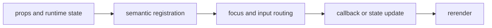

import { shellStory as ComponentStory } from '@/components/reference-stories.story';

## Overview

Compose full-screen terminal applications from a main content region, top application bar, and bottom status surface.

## Installation

```npm
npx @mwillbanks/tuil add app-shell app-bar status-bar
```

The CLI writes source-owned components beneath the destination configured in
`tuil.config.ts`; the default import below assumes `src/components/tuil`.

<ComponentStory.WithControl />

## Components and subcomponents

| Export | Kind | Source |
| --- | --- | --- |
| `AppShell` | function | `registry/components/app-shell.tsx` |
| `AppBar` | function | `registry/components/app-bar.tsx` |
| `StatusBar` | function | `registry/components/status-bar.tsx` |

## Interaction

These are structural components. Child navigation, commands, and controls own interaction.

## API and events

Shell components forward child behavior and do not emit their own events.

Every interactive component publishes semantic roles, labels, state, and focus
identity through the renderer's `SemanticRegistry`. Callback failures flow to
the owning application's error boundary.



## Example

```tsx
import type { ComponentProps } from "react";
import { AppShell } from "@/components/tuil/components/app-shell";

export function Example(props: ComponentProps<typeof AppShell>) {
  return <AppShell {...props} />;
}
```

Registry-installed components are source-owned: customize the generated file in
your application, and use the package reference for the shared runtime contracts.
