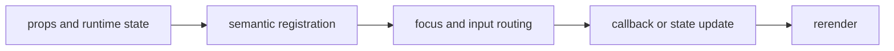

import { PublishedStory } from '@/components/published-story';

## Overview

A semantic, focusable terminal action with theme variants, disabled state, and keyboard activation.

## Installation

```npm
npx @mwillbanks/tuil add button
```

The CLI writes source-owned components beneath the destination configured in
`tuil.config.ts`; the default import below assumes `src/components/tuil`.

<PublishedStory storyId="component-acceptance" variant="Button" />

## Components and subcomponents

| API | Signature | Description |
| --- | --- | --- |
| [`Button`](/docs/reference/components/button/button) | `export Button` | Public export Button. |

## Interaction

Enter and Space invoke `onPress` while the button is enabled.

## API and events

`onPress` may be synchronous or asynchronous.

Every interactive component publishes semantic roles, labels, state, and focus
identity through the renderer's `SemanticRegistry`. Callback failures flow to
the owning application's error boundary.



## Example

```tsx
import type { ComponentProps } from "react";
import { Button } from "@/components/tuil/components/button";

export function Example(props: ComponentProps<typeof Button>) {
  return <Button {...props} />;
}
```

Registry-installed components are source-owned: customize the generated file in
your application, and use the package reference for the shared runtime contracts.
