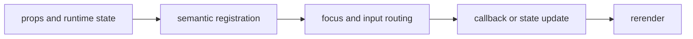

import { PublishedStory } from '@/components/published-story';

## Overview

Communicate messages, completion, and pending work with theme tokens and reduced-motion behavior.

## Installation

```npm
npx @mwillbanks/tuil add alert progress spinner
```

The CLI writes source-owned components beneath the destination configured in
`tuil.config.ts`; the default import below assumes `src/components/tuil`.

<PublishedStory storyId="component-acceptance" variant="Alert" />

## Components and subcomponents

| API | Signature | Description |
| --- | --- | --- |
| [`Alert`](/docs/reference/components/feedback/alert) | `function Alert` | Public function Alert. |
| [`Progress`](/docs/reference/components/feedback/progress) | `function Progress` | Public function Progress. |
| [`Spinner`](/docs/reference/components/feedback/spinner) | `function Spinner` | Public function Spinner. |

## Interaction

Read-only; update props as application state changes.

## API and events

No events are emitted.

Every interactive component publishes semantic roles, labels, state, and focus
identity through the renderer's `SemanticRegistry`. Callback failures flow to
the owning application's error boundary.



## Example

```tsx
import type { ComponentProps } from "react";
import { Alert } from "@/components/tuil/feedback/alert";

export function Example(props: ComponentProps<typeof Alert>) {
  return <Alert {...props} />;
}
```

Registry-installed components are source-owned: customize the generated file in
your application, and use the package reference for the shared runtime contracts.
