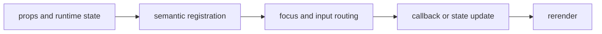

import { PublishedStory } from '@/components/published-story';

## Overview

Connect semantic terminal controls to typed form state, validation, descriptions, errors, hints, and submission.

## Installation

```npm
npx @mwillbanks/tuil add field text-input text-area number-input checkbox switch radio-group select multi-select autocomplete password-input search-input command-line code-editor inline-editor editable-table-cell editable-tree-node form-field-editor date-time-input
```

The CLI writes source-owned components beneath the destination configured in
`tuil.config.ts`; the default import below assumes `src/components/tuil`.

<PublishedStory storyId="component-acceptance" variant="Field" />

## Components and subcomponents

| API | Signature | Description |
| --- | --- | --- |
| [`Form`](/docs/reference/components/forms/form) | `function Form` | Public function Form. |
| [`ValidationSummary`](/docs/reference/components/forms/validation-summary) | `function ValidationSummary` | Public function ValidationSummary. |
| [`Field`](/docs/reference/components/forms/field) | `function Field` | Public function Field. |
| [`FieldLabel`](/docs/reference/components/forms/field-label) | `constant FieldLabel` | Public constant FieldLabel. |
| [`FieldDescription`](/docs/reference/components/forms/field-description) | `constant FieldDescription` | Public constant FieldDescription. |
| [`FieldError`](/docs/reference/components/forms/field-error) | `constant FieldError` | Public constant FieldError. |
| [`FieldHint`](/docs/reference/components/forms/field-hint) | `constant FieldHint` | Public constant FieldHint. |
| [`FieldGroup`](/docs/reference/components/forms/field-group) | `constant FieldGroup` | Public constant FieldGroup. |
| [`FieldSet`](/docs/reference/components/forms/field-set) | `constant FieldSet` | Public constant FieldSet. |
| [`TextInput`](/docs/reference/components/forms/text-input) | `function TextInput` | Public function TextInput. |
| [`TextArea`](/docs/reference/components/forms/text-area) | `function TextArea` | Public function TextArea. |
| [`NumberInput`](/docs/reference/components/forms/number-input) | `function NumberInput` | Public function NumberInput. |
| [`Checkbox`](/docs/reference/components/forms/checkbox) | `function Checkbox` | Public function Checkbox. |
| [`Switch`](/docs/reference/components/forms/switch) | `function Switch` | Public function Switch. |
| [`RadioGroup`](/docs/reference/components/forms/radio-group) | `function RadioGroup` | Public function RadioGroup. |
| [`Select`](/docs/reference/components/forms/select) | `function Select` | Public function Select. |
| [`MultiSelect`](/docs/reference/components/forms/multi-select) | `function MultiSelect` | Public function MultiSelect. |
| [`Autocomplete`](/docs/reference/components/forms/autocomplete) | `function Autocomplete` | Public function Autocomplete. |
| [`PasswordInput`](/docs/reference/components/forms/password-input) | `function PasswordInput` | Public function PasswordInput. |
| [`SearchInput`](/docs/reference/components/forms/search-input) | `function SearchInput` | Public function SearchInput. |
| [`CommandLine`](/docs/reference/components/forms/command-line) | `function CommandLine` | Public function CommandLine. |
| [`CodeEditor`](/docs/reference/components/forms/code-editor) | `function CodeEditor` | Public function CodeEditor. |
| [`InlineEditor`](/docs/reference/components/forms/inline-editor) | `constant InlineEditor` | Public constant InlineEditor. |
| [`EditableTableCell`](/docs/reference/components/forms/editable-table-cell) | `constant EditableTableCell` | Public constant EditableTableCell. |
| [`EditableTreeNode`](/docs/reference/components/forms/editable-tree-node) | `constant EditableTreeNode` | Public constant EditableTreeNode. |
| [`FormFieldEditor`](/docs/reference/components/forms/form-field-editor) | `constant FormFieldEditor` | Public constant FormFieldEditor. |
| [`DateTimeInput`](/docs/reference/components/forms/date-time-input) | `function DateTimeInput` | Public function DateTimeInput. |

## Interaction

Text controls edit directly; choice controls use arrows and Space or Enter; `Form` coordinates validation and submission.

## API and events

Controls expose `onValueChange`, `onSubmit`, focus, selection, and validation callbacks.

Every interactive component publishes semantic roles, labels, state, and focus
identity through the renderer's `SemanticRegistry`. Callback failures flow to
the owning application's error boundary.



## Example

```tsx
import type { ComponentProps } from "react";
import { Form } from "@/components/tuil/forms/controls";

export function Example(props: ComponentProps<typeof Form>) {
  return <Form {...props} />;
}
```

Registry-installed components are source-owned: customize the generated file in
your application, and use the package reference for the shared runtime contracts.
