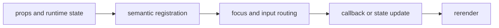

import { formsStory as ComponentStory } from '@/components/reference-stories.story';

## Overview

Connect semantic terminal controls to typed form state, validation, descriptions, errors, hints, and submission.

## Installation

```npm
npx @mwillbanks/tuil add field text-input text-area number-input checkbox switch radio-group select multi-select autocomplete password-input search-input command-line code-editor inline-editor editable-table-cell editable-tree-node form-field-editor date-time-input
```

The CLI writes source-owned components beneath the destination configured in
`tuil.config.ts`; the default import below assumes `src/components/tuil`.

<ComponentStory.WithControl />

## Components and subcomponents

| Export | Kind | Source |
| --- | --- | --- |
| `Form` | function | `registry/forms/controls.tsx` |
| `ValidationSummary` | function | `registry/forms/controls.tsx` |
| `Field` | function | `registry/forms/controls.tsx` |
| `FieldLabel` | constant | `registry/forms/controls.tsx` |
| `FieldDescription` | constant | `registry/forms/controls.tsx` |
| `FieldError` | constant | `registry/forms/controls.tsx` |
| `FieldHint` | constant | `registry/forms/controls.tsx` |
| `FieldGroup` | constant | `registry/forms/controls.tsx` |
| `FieldSet` | constant | `registry/forms/controls.tsx` |
| `TextInput` | function | `registry/forms/controls.tsx` |
| `TextArea` | function | `registry/forms/controls.tsx` |
| `NumberInput` | function | `registry/forms/controls.tsx` |
| `Checkbox` | function | `registry/forms/controls.tsx` |
| `Switch` | function | `registry/forms/controls.tsx` |
| `RadioGroup` | function | `registry/forms/controls.tsx` |
| `Select` | function | `registry/forms/controls.tsx` |
| `MultiSelect` | function | `registry/forms/controls.tsx` |
| `Autocomplete` | function | `registry/forms/controls.tsx` |
| `PasswordInput` | function | `registry/forms/controls.tsx` |
| `SearchInput` | function | `registry/forms/controls.tsx` |
| `CommandLine` | function | `registry/forms/controls.tsx` |
| `CodeEditor` | function | `registry/forms/controls.tsx` |
| `InlineEditor` | constant | `registry/forms/controls.tsx` |
| `EditableTableCell` | constant | `registry/forms/controls.tsx` |
| `EditableTreeNode` | constant | `registry/forms/controls.tsx` |
| `FormFieldEditor` | constant | `registry/forms/controls.tsx` |
| `DateTimeInput` | function | `registry/forms/controls.tsx` |

## Interaction

Text controls edit directly; choice controls use arrows and Space or Enter; `Form` coordinates validation and submission.

## API and events

Controls expose `onValueChange`, `onSubmit`, focus, selection, and validation callbacks.

Every interactive component publishes semantic roles, labels, state, and focus
identity through the renderer's `SemanticRegistry`. Callback failures flow to
the owning application's error boundary.



## Example

```tsx
import type { ComponentProps } from "react";
import { Form } from "@/components/tuil/forms/controls";

export function Example(props: ComponentProps<typeof Form>) {
  return <Form {...props} />;
}
```

Registry-installed components are source-owned: customize the generated file in
your application, and use the package reference for the shared runtime contracts.
