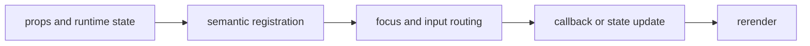

import { PublishedStory } from '@/components/published-story';

## Overview

A complete source-owned application block combining forms, navigation, dialogs, operations, themes, and workflow state into a project creator.

## Installation

```npm
npx @mwillbanks/tuil add init-wizard
```

The CLI writes source-owned components beneath the destination configured in
`tuil.config.ts`; the default import below assumes `src/components/tuil`.

<PublishedStory storyId="component-acceptance" variant="InitWizard" />

## Components and subcomponents

| API | Signature | Description |
| --- | --- | --- |
| [`InitWizard`](/docs/reference/components/initializer/init-wizard) | `function InitWizard` | Public function InitWizard. |

## Interaction

The guided flow validates names, template choice, features, confirmation, cancellation, and capability-aware static fallbacks.

## API and events

`onComplete` returns validated answers and `onCancel` reports abandonment.

Every interactive component publishes semantic roles, labels, state, and focus
identity through the renderer's `SemanticRegistry`. Callback failures flow to
the owning application's error boundary.



## Example

```tsx
import type { ComponentProps } from "react";
import { InitWizard } from "@/components/tuil/blocks/init-wizard";

export function Example(props: ComponentProps<typeof InitWizard>) {
  return <InitWizard {...props} />;
}
```

Registry-installed components are source-owned: customize the generated file in
your application, and use the package reference for the shared runtime contracts.
