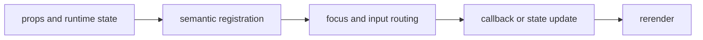

import { layoutStory as ComponentStory } from '@/components/reference-stories.story';

## Overview

Build capability-aware rows, columns, bounded containers, split panes, and keyboard-resizable regions.

## Installation

```npm
npx @mwillbanks/tuil add box container stack split-pane header footer sidebar pane-tabs scroll-area resizable-pane
```

The CLI writes source-owned components beneath the destination configured in
`tuil.config.ts`; the default import below assumes `src/components/tuil`.

<ComponentStory.WithControl />

## Components and subcomponents

| Export | Kind | Source |
| --- | --- | --- |
| `Box` | function | `registry/primitives/box.tsx` |
| `Container` | function | `registry/primitives/container.tsx` |
| `Stack` | function | `registry/primitives/stack.tsx` |
| `HStack` | function | `registry/primitives/stack.tsx` |
| `VStack` | function | `registry/primitives/stack.tsx` |
| `Pane` | component | `registry/primitives/box.tsx` |
| `SplitPane` | function | `registry/layout/panes.tsx` |
| `Header` | constant | `registry/layout/panes.tsx` |
| `Footer` | constant | `registry/layout/panes.tsx` |
| `Sidebar` | constant | `registry/layout/panes.tsx` |
| `PaneTabs` | function | `registry/layout/panes.tsx` |
| `ScrollArea` | function | `registry/layout/panes.tsx` |
| `ResizablePane` | function | `registry/layout/resizable-pane.tsx` |

## Interaction

Resizable panes consume scoped arrow-key input while passive layout primitives only project Ink layout props.

## API and events

`ResizablePane` reports size changes through `onSizeChange`; other layout components are passive.

Every interactive component publishes semantic roles, labels, state, and focus
identity through the renderer's `SemanticRegistry`. Callback failures flow to
the owning application's error boundary.



## Example

```tsx
import type { ComponentProps } from "react";
import { Box } from "@/components/tuil/primitives/box";

export function Example(props: ComponentProps<typeof Box>) {
  return <Box {...props} />;
}
```

Registry-installed components are source-owned: customize the generated file in
your application, and use the package reference for the shared runtime contracts.
