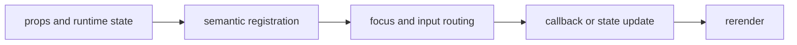

import { PublishedStory } from '@/components/published-story';

## Overview

Build capability-aware rows, columns, bounded containers, split panes, and keyboard-resizable regions.

## Installation

```npm
npx @mwillbanks/tuil add box container stack split-pane header footer sidebar pane-tabs scroll-area resizable-pane
```

The CLI writes source-owned components beneath the destination configured in
`tuil.config.ts`; the default import below assumes `src/components/tuil`.

<PublishedStory storyId="component-acceptance" variant="Box" />

## Components and subcomponents

| API | Signature | Description |
| --- | --- | --- |
| [`Box`](/docs/reference/components/layout/box) | `function Box` | Public function Box. |
| [`Container`](/docs/reference/components/layout/container) | `function Container` | Public function Container. |
| [`Stack`](/docs/reference/components/layout/stack) | `function Stack` | Public function Stack. |
| [`HStack`](/docs/reference/components/layout/hstack) | `function HStack` | Public function HStack. |
| [`VStack`](/docs/reference/components/layout/vstack) | `function VStack` | Public function VStack. |
| [`Pane`](/docs/reference/components/layout/pane) | `component Pane` | Public component Pane. |
| [`SplitPane`](/docs/reference/components/layout/split-pane) | `function SplitPane` | Public function SplitPane. |
| [`Header`](/docs/reference/components/layout/header) | `constant Header` | Public constant Header. |
| [`Footer`](/docs/reference/components/layout/footer) | `constant Footer` | Public constant Footer. |
| [`Sidebar`](/docs/reference/components/layout/sidebar) | `constant Sidebar` | Public constant Sidebar. |
| [`PaneTabs`](/docs/reference/components/layout/pane-tabs) | `function PaneTabs` | Public function PaneTabs. |
| [`ScrollArea`](/docs/reference/components/layout/scroll-area) | `function ScrollArea` | Public function ScrollArea. |
| [`ResizablePane`](/docs/reference/components/layout/resizable-pane) | `function ResizablePane` | Public function ResizablePane. |

## Interaction

Resizable panes consume scoped arrow-key input while passive layout primitives only project Ink layout props.

## API and events

`ResizablePane` reports size changes through `onSizeChange`; other layout components are passive.

Every interactive component publishes semantic roles, labels, state, and focus
identity through the renderer's `SemanticRegistry`. Callback failures flow to
the owning application's error boundary.



## Example

```tsx
import type { ComponentProps } from "react";
import { Box } from "@/components/tuil/primitives/box";

export function Example(props: ComponentProps<typeof Box>) {
  return <Box {...props} />;
}
```

Registry-installed components are source-owned: customize the generated file in
your application, and use the package reference for the shared runtime contracts.
