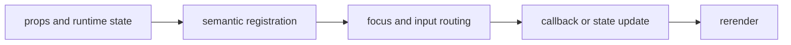

import { navigationStory as ComponentStory } from '@/components/reference-stories.story';

## Overview

Provide terminal-native local navigation, command menus, hierarchical trails, and workflow progress.

## Installation

```npm
npx @mwillbanks/tuil add tabs menu menubar breadcrumbs stepper tab-select pagination outline
```

The CLI writes source-owned components beneath the destination configured in
`tuil.config.ts`; the default import below assumes `src/components/tuil`.

<ComponentStory.WithControl />

## Components and subcomponents

| Export | Kind | Source |
| --- | --- | --- |
| `Tabs` | function | `registry/navigation/navigation.tsx` |
| `Menu` | function | `registry/navigation/navigation.tsx` |
| `Menubar` | function | `registry/navigation/navigation.tsx` |
| `Breadcrumbs` | function | `registry/navigation/navigation.tsx` |
| `Stepper` | function | `registry/navigation/navigation.tsx` |
| `TabSelect` | constant | `registry/navigation/navigation.tsx` |
| `Pagination` | function | `registry/navigation/navigation.tsx` |
| `Outline` | function | `registry/navigation/navigation.tsx` |

## Interaction

Arrow keys move within the active navigation model; Enter selects or activates.

## API and events

Selections and value changes are reported through component callbacks.

Every interactive component publishes semantic roles, labels, state, and focus
identity through the renderer's `SemanticRegistry`. Callback failures flow to
the owning application's error boundary.



## Example

```tsx
import type { ComponentProps } from "react";
import { Tabs } from "@/components/tuil/navigation/navigation";

export function Example(props: ComponentProps<typeof Tabs>) {
  return <Tabs {...props} />;
}
```

Registry-installed components are source-owned: customize the generated file in
your application, and use the package reference for the shared runtime contracts.
