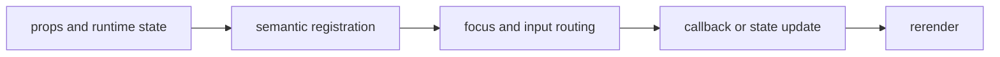

import { PublishedStory } from '@/components/published-story';

## Overview

Layer focus-trapped dialogs, contextual help, transient notices, and searchable command execution over an application.

## Installation

```npm
npx @mwillbanks/tuil add dialog confirm-dialog tooltip toast command-palette drawer popover skeleton error-boundary
```

The CLI writes source-owned components beneath the destination configured in
`tuil.config.ts`; the default import below assumes `src/components/tuil`.

<PublishedStory storyId="component-acceptance" variant="Dialog" />

## Components and subcomponents

| API | Signature | Description |
| --- | --- | --- |
| [`Dialog`](/docs/reference/components/overlays/dialog) | `constant Dialog` | Public constant Dialog. |
| [`Dialog.Trigger`](/docs/reference/components/overlays/dialog-trigger) | `subcomponent Dialog.Trigger` | Public subcomponent Dialog.Trigger. |
| [`Dialog.Content`](/docs/reference/components/overlays/dialog-content) | `subcomponent Dialog.Content` | Public subcomponent Dialog.Content. |
| [`Dialog.Title`](/docs/reference/components/overlays/dialog-title) | `subcomponent Dialog.Title` | Public subcomponent Dialog.Title. |
| [`Dialog.Description`](/docs/reference/components/overlays/dialog-description) | `subcomponent Dialog.Description` | Public subcomponent Dialog.Description. |
| [`Dialog.Confirm`](/docs/reference/components/overlays/dialog-confirm) | `subcomponent Dialog.Confirm` | Public subcomponent Dialog.Confirm. |
| [`Dialog.Cancel`](/docs/reference/components/overlays/dialog-cancel) | `subcomponent Dialog.Cancel` | Public subcomponent Dialog.Cancel. |
| [`ConfirmDialog`](/docs/reference/components/overlays/confirm-dialog) | `function ConfirmDialog` | Public function ConfirmDialog. |
| [`Tooltip`](/docs/reference/components/overlays/tooltip) | `function Tooltip` | Public function Tooltip. |
| [`ToastProvider`](/docs/reference/components/overlays/toast-provider) | `function ToastProvider` | Public function ToastProvider. |
| [`useToast`](/docs/reference/components/overlays/use-toast) | `function useToast` | Public function useToast. |
| [`Toast`](/docs/reference/components/overlays/toast) | `function Toast` | Public function Toast. |
| [`ToastViewport`](/docs/reference/components/overlays/toast-viewport) | `function ToastViewport` | Public function ToastViewport. |
| [`CommandPalette`](/docs/reference/components/overlays/command-palette) | `function CommandPalette` | Public function CommandPalette. |
| [`Drawer`](/docs/reference/components/overlays/drawer) | `constant Drawer` | Public constant Drawer. |
| [`Popover`](/docs/reference/components/overlays/popover) | `constant Popover` | Public constant Popover. |
| [`Skeleton`](/docs/reference/components/overlays/skeleton) | `function Skeleton` | Public function Skeleton. |
| [`ErrorBoundary`](/docs/reference/components/overlays/error-boundary) | `class ErrorBoundary` | Public class ErrorBoundary. |

## Interaction

The top overlay receives input before application hotkeys. Escape closes dismissible overlays and focus returns to the prior node.

## API and events

Open state and selections flow through `onOpenChange`, `onPress`, command callbacks, and the toast API.

Every interactive component publishes semantic roles, labels, state, and focus
identity through the renderer's `SemanticRegistry`. Callback failures flow to
the owning application's error boundary.



## Example

```tsx
import type { ComponentProps } from "react";
import { Dialog } from "@/components/tuil/feedback/overlays";

export function Example(props: ComponentProps<typeof Dialog>) {
  return <Dialog {...props} />;
}
```

Registry-installed components are source-owned: customize the generated file in
your application, and use the package reference for the shared runtime contracts.
