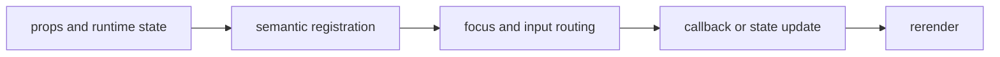

import { overlaysStory as ComponentStory } from '@/components/reference-stories.story';

## Overview

Layer focus-trapped dialogs, contextual help, transient notices, and searchable command execution over an application.

## Installation

```npm
npx @mwillbanks/tuil add dialog confirm-dialog tooltip toast command-palette drawer popover skeleton error-boundary
```

The CLI writes source-owned components beneath the destination configured in
`tuil.config.ts`; the default import below assumes `src/components/tuil`.

<ComponentStory.WithControl />

## Components and subcomponents

| Export | Kind | Source |
| --- | --- | --- |
| `Dialog` | constant | `registry/feedback/overlays.tsx` |
| `Dialog.Trigger` | subcomponent | `registry/feedback/overlays.tsx` |
| `Dialog.Content` | subcomponent | `registry/feedback/overlays.tsx` |
| `Dialog.Title` | subcomponent | `registry/feedback/overlays.tsx` |
| `Dialog.Description` | subcomponent | `registry/feedback/overlays.tsx` |
| `Dialog.Confirm` | subcomponent | `registry/feedback/overlays.tsx` |
| `Dialog.Cancel` | subcomponent | `registry/feedback/overlays.tsx` |
| `ConfirmDialog` | function | `registry/feedback/overlays.tsx` |
| `Tooltip` | function | `registry/feedback/overlays.tsx` |
| `ToastProvider` | function | `registry/feedback/overlays.tsx` |
| `useToast` | function | `registry/feedback/overlays.tsx` |
| `Toast` | function | `registry/feedback/overlays.tsx` |
| `ToastViewport` | function | `registry/feedback/overlays.tsx` |
| `CommandPalette` | function | `registry/feedback/overlays.tsx` |
| `Drawer` | constant | `registry/feedback/overlays.tsx` |
| `Popover` | constant | `registry/feedback/overlays.tsx` |
| `Skeleton` | function | `registry/feedback/overlays.tsx` |
| `ErrorBoundary` | class | `registry/feedback/overlays.tsx` |

## Interaction

The top overlay receives input before application hotkeys. Escape closes dismissible overlays and focus returns to the prior node.

## API and events

Open state and selections flow through `onOpenChange`, `onPress`, command callbacks, and the toast API.

Every interactive component publishes semantic roles, labels, state, and focus
identity through the renderer's `SemanticRegistry`. Callback failures flow to
the owning application's error boundary.



## Example

```tsx
import type { ComponentProps } from "react";
import { Dialog } from "@/components/tuil/feedback/overlays";

export function Example(props: ComponentProps<typeof Dialog>) {
  return <Dialog {...props} />;
}
```

Registry-installed components are source-owned: customize the generated file in
your application, and use the package reference for the shared runtime contracts.
