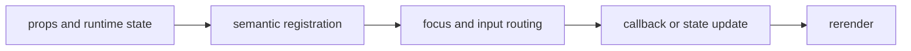

import { PublishedStory } from '@/components/published-story';

## Overview

Inspect streaming logs, expandable structured values, and line-oriented changes in terminal-bounded viewports.

## Installation

```npm
npx @mwillbanks/tuil add log-viewer json-viewer diff-viewer markdown-viewer code-viewer timeline bar-chart structured-content rich-diff-viewer
```

The CLI writes source-owned components beneath the destination configured in
`tuil.config.ts`; the default import below assumes `src/components/tuil`.

<PublishedStory storyId="component-acceptance" variant="LogViewer" />

## Components and subcomponents

| API | Signature | Description |
| --- | --- | --- |
| [`LogViewer`](/docs/reference/components/structured-viewers/log-viewer) | `function LogViewer` | Public function LogViewer. |
| [`JsonViewer`](/docs/reference/components/structured-viewers/json-viewer) | `function JsonViewer` | Public function JsonViewer. |
| [`flattenJson`](/docs/reference/components/structured-viewers/flatten-json) | `function flattenJson` | Public function flattenJson. |
| [`DiffViewer`](/docs/reference/components/structured-viewers/diff-viewer) | `function DiffViewer` | Public function DiffViewer. |
| [`createLineDiff`](/docs/reference/components/structured-viewers/create-line-diff) | `function createLineDiff` | Public function createLineDiff. |
| [`MarkdownViewer`](/docs/reference/components/structured-viewers/markdown-viewer) | `function MarkdownViewer` | Public function MarkdownViewer. |
| [`CodeViewer`](/docs/reference/components/structured-viewers/code-viewer) | `function CodeViewer` | Public function CodeViewer. |
| [`Timeline`](/docs/reference/components/structured-viewers/timeline) | `function Timeline` | Public function Timeline. |
| [`BarChart`](/docs/reference/components/structured-viewers/bar-chart) | `function BarChart` | Public function BarChart. |
| [`StructuredContentSummary`](/docs/reference/components/structured-viewers/structured-content-summary) | `function StructuredContentSummary` | Public function StructuredContentSummary. |
| [`RichDiffViewer`](/docs/reference/components/structured-viewers/rich-diff-viewer) | `function RichDiffViewer` | Public function RichDiffViewer. |

## Interaction

Viewers scroll and filter; JSON nodes expand or collapse; diff output remains deterministic in static mode.

## API and events

`LogViewer` reports follow state; JSON expansion can be controlled; pure transformation helpers emit nothing.

Every interactive component publishes semantic roles, labels, state, and focus
identity through the renderer's `SemanticRegistry`. Callback failures flow to
the owning application's error boundary.



## Example

```tsx
import type { ComponentProps } from "react";
import { LogViewer } from "@/components/tuil/data-display/log-viewer";

export function Example(props: ComponentProps<typeof LogViewer>) {
  return <LogViewer {...props} />;
}
```

Registry-installed components are source-owned: customize the generated file in
your application, and use the package reference for the shared runtime contracts.
