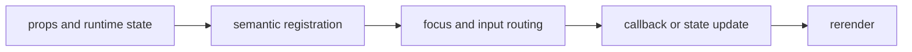

import { logsStory as ComponentStory } from '@/components/reference-stories.story';

## Overview

Inspect streaming logs, expandable structured values, and line-oriented changes in terminal-bounded viewports.

## Installation

```npm
npx @mwillbanks/tuil add log-viewer json-viewer diff-viewer markdown-viewer code-viewer timeline bar-chart structured-content rich-diff-viewer
```

The CLI writes source-owned components beneath the destination configured in
`tuil.config.ts`; the default import below assumes `src/components/tuil`.

<ComponentStory.WithControl />

## Components and subcomponents

| Export | Kind | Source |
| --- | --- | --- |
| `LogViewer` | function | `registry/data-display/log-viewer.tsx` |
| `JsonViewer` | function | `registry/data-display/json-viewer.tsx` |
| `flattenJson` | function | `registry/data-display/json-viewer.tsx` |
| `DiffViewer` | function | `registry/data-display/diff-viewer.tsx` |
| `createLineDiff` | function | `registry/data-display/diff-viewer.tsx` |
| `MarkdownViewer` | function | `registry/data-display/rich-content.tsx` |
| `CodeViewer` | function | `registry/data-display/rich-content.tsx` |
| `Timeline` | function | `registry/data-display/rich-content.tsx` |
| `BarChart` | function | `registry/data-display/rich-content.tsx` |
| `StructuredContentSummary` | function | `registry/data-display/rich-content.tsx` |
| `RichDiffViewer` | function | `registry/data-display/rich-content.tsx` |

## Interaction

Viewers scroll and filter; JSON nodes expand or collapse; diff output remains deterministic in static mode.

## API and events

`LogViewer` reports follow state; JSON expansion can be controlled; pure transformation helpers emit nothing.

Every interactive component publishes semantic roles, labels, state, and focus
identity through the renderer's `SemanticRegistry`. Callback failures flow to
the owning application's error boundary.



## Example

```tsx
import type { ComponentProps } from "react";
import { LogViewer } from "@/components/tuil/data-display/log-viewer";

export function Example(props: ComponentProps<typeof LogViewer>) {
  return <LogViewer {...props} />;
}
```

Registry-installed components are source-owned: customize the generated file in
your application, and use the package reference for the shared runtime contracts.
