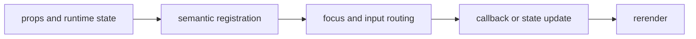

import { PublishedStory } from '@/components/published-story';

## Overview

Render typed rows and columns with terminal-width fitting, virtualization, sorting, selection, and cell activation.

## Installation

```npm
npx @mwillbanks/tuil add table data-table
```

The CLI writes source-owned components beneath the destination configured in
`tuil.config.ts`; the default import below assumes `src/components/tuil`.

<PublishedStory storyId="component-acceptance" variant="Table" />

## Components and subcomponents

| API | Signature | Description |
| --- | --- | --- |
| [`Table`](/docs/reference/components/tables/table) | `function Table` | Public function Table. |
| [`DataTable`](/docs/reference/components/tables/data-table) | `function DataTable` | Public function DataTable. |

## Interaction

Arrow keys navigate cells or rows; Space toggles selection; Enter activates; configured keys sort columns.

## API and events

`onActivate`, `onSelectionChange`, `onToggleSelection`, and `onSortColumn` expose table intent.

Every interactive component publishes semantic roles, labels, state, and focus
identity through the renderer's `SemanticRegistry`. Callback failures flow to
the owning application's error boundary.



## Example

```tsx
import type { ComponentProps } from "react";
import { Table } from "@/components/tuil/data-display/complex-data";

export function Example(props: ComponentProps<typeof Table>) {
  return <Table {...props} />;
}
```

Registry-installed components are source-owned: customize the generated file in
your application, and use the package reference for the shared runtime contracts.
