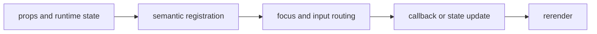

import { imageStory as ComponentStory } from '@/components/reference-stories.story';

## Overview

Render terminal images when the capability profile permits them and deterministic text fallbacks everywhere else.

<ComponentStory.WithControl />

## Components and subcomponents

| Export | Kind | Source |
| --- | --- | --- |
| `Image` | component | `packages/ink/src/image.tsx` |
| `resolveImageProtocol` | component | `packages/ink/src/image.tsx` |
| `renderImageFallback` | component | `packages/ink/src/image.tsx` |

## Interaction

Image output follows terminal capability detection and explicit dimensions.

## API and events

No events are emitted.

Every interactive component publishes semantic roles, labels, state, and focus
identity through the renderer's `SemanticRegistry`. Callback failures flow to
the owning application's error boundary.



## Example

```tsx
import type { ComponentProps } from "react";
import { Image } from "@mwillbanks/tuil-ink";

export function Example(props: ComponentProps<typeof Image>) {
  return <Image {...props} />;
}
```

Registry-installed components are source-owned: customize the generated file in
your application, and use the package reference for the shared runtime contracts.
