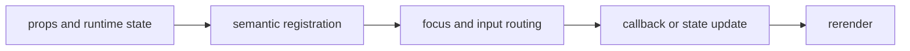

import { transferStory as ComponentStory } from '@/components/reference-stories.story';

## Overview

Move typed items between available and selected collections without losing keyboard focus or semantic identity.

## Installation

```npm
npx @mwillbanks/tuil add transfer-list
```

The CLI writes source-owned components beneath the destination configured in
`tuil.config.ts`; the default import below assumes `src/components/tuil`.

<ComponentStory.WithControl />

## Components and subcomponents

| Export | Kind | Source |
| --- | --- | --- |
| `TransferList` | function | `registry/forms/transfer-list.tsx` |

## Interaction

Arrow keys navigate, Space selects, and Tab changes the active collection.

## API and events

`onValueChange` receives the selected item set.

Every interactive component publishes semantic roles, labels, state, and focus
identity through the renderer's `SemanticRegistry`. Callback failures flow to
the owning application's error boundary.



## Example

```tsx
import type { ComponentProps } from "react";
import { TransferList } from "@/components/tuil/forms/transfer-list";

export function Example(props: ComponentProps<typeof TransferList>) {
  return <TransferList {...props} />;
}
```

Registry-installed components are source-owned: customize the generated file in
your application, and use the package reference for the shared runtime contracts.
