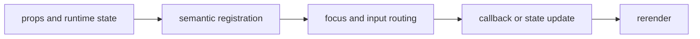

import { treeStory as ComponentStory } from '@/components/reference-stories.story';

## Overview

Display nested typed data with stable IDs, expansion state, virtual rows, and semantic tree nodes.

## Installation

```npm
npx @mwillbanks/tuil add tree
```

The CLI writes source-owned components beneath the destination configured in
`tuil.config.ts`; the default import below assumes `src/components/tuil`.

<ComponentStory.WithControl />

## Components and subcomponents

| Export | Kind | Source |
| --- | --- | --- |
| `Tree` | function | `registry/data-display/tree.tsx` |

## Interaction

Up and Down move, Right expands, Left collapses or moves to the parent, and Enter activates.

## API and events

Expansion and activation are surfaced through callbacks.

Every interactive component publishes semantic roles, labels, state, and focus
identity through the renderer's `SemanticRegistry`. Callback failures flow to
the owning application's error boundary.



## Example

```tsx
import type { ComponentProps } from "react";
import { Tree } from "@/components/tuil/data-display/tree";

export function Example(props: ComponentProps<typeof Tree>) {
  return <Tree {...props} />;
}
```

Registry-installed components are source-owned: customize the generated file in
your application, and use the package reference for the shared runtime contracts.
