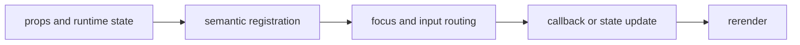

import { PublishedStory } from '@/components/published-story';

## Overview

Render styled terminal copy, hierarchy, separators, labels, and compact status signals with semantic metadata.

## Installation

```npm
npx @mwillbanks/tuil add text heading divider badge
```

The CLI writes source-owned components beneath the destination configured in
`tuil.config.ts`; the default import below assumes `src/components/tuil`.

<PublishedStory storyId="component-acceptance" variant="Text" />

## Components and subcomponents

| API | Signature | Description |
| --- | --- | --- |
| [`Text`](/docs/reference/components/typography-status/text) | `function Text` | Public function Text. |
| [`Heading`](/docs/reference/components/typography-status/heading) | `function Heading` | Public function Heading. |
| [`Divider`](/docs/reference/components/typography-status/divider) | `function Divider` | Public function Divider. |
| [`Badge`](/docs/reference/components/typography-status/badge) | `function Badge` | Public function Badge. |

## Interaction

Read-only presentation; accessibility lives in semantic role and label metadata.

## API and events

No events are emitted.

Every interactive component publishes semantic roles, labels, state, and focus
identity through the renderer's `SemanticRegistry`. Callback failures flow to
the owning application's error boundary.



## Example

```tsx
import type { ComponentProps } from "react";
import { Text } from "@/components/tuil/data-display/text";

export function Example(props: ComponentProps<typeof Text>) {
  return <Text {...props} />;
}
```

Registry-installed components are source-owned: customize the generated file in
your application, and use the package reference for the shared runtime contracts.
