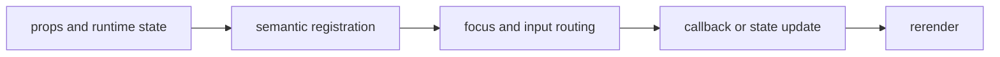

import { PublishedStory } from '@/components/published-story';

## Overview

Render large collections by projecting only the terminal-visible range plus configurable overscan.

## Installation

```npm
npx @mwillbanks/tuil add virtual-list
```

The CLI writes source-owned components beneath the destination configured in
`tuil.config.ts`; the default import below assumes `src/components/tuil`.

<PublishedStory storyId="component-acceptance" variant="VirtualList" />

## Components and subcomponents

| API | Signature | Description |
| --- | --- | --- |
| [`VirtualList`](/docs/reference/components/virtual-list/virtual-list) | `function VirtualList` | Public function VirtualList. |

## Interaction

The host controls scroll offset and active item while the component maintains semantic row identity.

## API and events

Range and activation changes are exposed through callbacks.

Every interactive component publishes semantic roles, labels, state, and focus
identity through the renderer's `SemanticRegistry`. Callback failures flow to
the owning application's error boundary.



## Example

```tsx
import type { ComponentProps } from "react";
import { VirtualList } from "@/components/tuil/data-display/virtual-list";

export function Example(props: ComponentProps<typeof VirtualList>) {
  return <VirtualList {...props} />;
}
```

Registry-installed components are source-owned: customize the generated file in
your application, and use the package reference for the shared runtime contracts.
