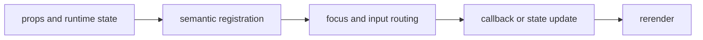

import { workflowStory as ComponentStory } from '@/components/reference-stories.story';

## Overview

Bind observable workflow and operation snapshots to guided terminal flows, progress, errors, cancellation, splash state, and contextual help.

## Installation

```npm
npx @mwillbanks/tuil add workflow operation-list operation-tree splash-screen help-overlay
```

The CLI writes source-owned components beneath the destination configured in
`tuil.config.ts`; the default import below assumes `src/components/tuil`.

<ComponentStory.WithControl />

## Components and subcomponents

| Export | Kind | Source |
| --- | --- | --- |
| `Workflow` | constant | `registry/workflows/workflow.tsx` |
| `Workflow.Header` | subcomponent | `registry/workflows/workflow.tsx` |
| `Workflow.Body` | subcomponent | `registry/workflows/workflow.tsx` |
| `Workflow.Footer` | subcomponent | `registry/workflows/workflow.tsx` |
| `Workflow.Progress` | subcomponent | `registry/workflows/workflow.tsx` |
| `Workflow.Errors` | subcomponent | `registry/workflows/workflow.tsx` |
| `Workflow.Next` | subcomponent | `registry/workflows/workflow.tsx` |
| `Workflow.Back` | subcomponent | `registry/workflows/workflow.tsx` |
| `Workflow.Skip` | subcomponent | `registry/workflows/workflow.tsx` |
| `Workflow.Cancel` | subcomponent | `registry/workflows/workflow.tsx` |
| `OperationList` | function | `registry/workflows/workflow.tsx` |
| `OperationTree` | function | `registry/workflows/workflow.tsx` |
| `SplashScreen` | function | `registry/workflows/workflow.tsx` |
| `HelpOverlay` | function | `registry/workflows/workflow.tsx` |

## Interaction

Controls call the runner's next, back, skip, retry, cancel, and rollback operations with transition locking.

## API and events

The runner emits the complete `workflow:*` lifecycle; operation components reflect operation snapshots and callbacks.

Every interactive component publishes semantic roles, labels, state, and focus
identity through the renderer's `SemanticRegistry`. Callback failures flow to
the owning application's error boundary.



## Example

```tsx
import type { ComponentProps } from "react";
import { Workflow } from "@/components/tuil/workflows/workflow";

export function Example(props: ComponentProps<typeof Workflow>) {
  return <Workflow {...props} />;
}
```

Registry-installed components are source-owned: customize the generated file in
your application, and use the package reference for the shared runtime contracts.
