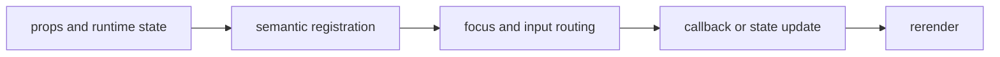

import { PublishedStory } from '@/components/published-story';

## Overview

Bind observable workflow and operation snapshots to guided terminal flows, progress, errors, cancellation, splash state, and contextual help.

## Installation

```npm
npx @mwillbanks/tuil add workflow operation-list operation-tree splash-screen help-overlay
```

The CLI writes source-owned components beneath the destination configured in
`tuil.config.ts`; the default import below assumes `src/components/tuil`.

<PublishedStory storyId="component-acceptance" variant="Workflow" />

## Components and subcomponents

| API | Signature | Description |
| --- | --- | --- |
| [`Workflow`](/docs/reference/components/workflow/workflow) | `constant Workflow` | Public constant Workflow. |
| [`Workflow.Header`](/docs/reference/components/workflow/workflow-header) | `subcomponent Workflow.Header` | Public subcomponent Workflow.Header. |
| [`Workflow.Body`](/docs/reference/components/workflow/workflow-body) | `subcomponent Workflow.Body` | Public subcomponent Workflow.Body. |
| [`Workflow.Footer`](/docs/reference/components/workflow/workflow-footer) | `subcomponent Workflow.Footer` | Public subcomponent Workflow.Footer. |
| [`Workflow.Progress`](/docs/reference/components/workflow/workflow-progress) | `subcomponent Workflow.Progress` | Public subcomponent Workflow.Progress. |
| [`Workflow.Errors`](/docs/reference/components/workflow/workflow-errors) | `subcomponent Workflow.Errors` | Public subcomponent Workflow.Errors. |
| [`Workflow.Next`](/docs/reference/components/workflow/workflow-next) | `subcomponent Workflow.Next` | Public subcomponent Workflow.Next. |
| [`Workflow.Back`](/docs/reference/components/workflow/workflow-back) | `subcomponent Workflow.Back` | Public subcomponent Workflow.Back. |
| [`Workflow.Skip`](/docs/reference/components/workflow/workflow-skip) | `subcomponent Workflow.Skip` | Public subcomponent Workflow.Skip. |
| [`Workflow.Cancel`](/docs/reference/components/workflow/workflow-cancel) | `subcomponent Workflow.Cancel` | Public subcomponent Workflow.Cancel. |
| [`OperationList`](/docs/reference/components/workflow/operation-list) | `function OperationList` | Public function OperationList. |
| [`OperationTree`](/docs/reference/components/workflow/operation-tree) | `function OperationTree` | Public function OperationTree. |
| [`SplashScreen`](/docs/reference/components/workflow/splash-screen) | `function SplashScreen` | Public function SplashScreen. |
| [`HelpOverlay`](/docs/reference/components/workflow/help-overlay) | `function HelpOverlay` | Public function HelpOverlay. |

## Interaction

Controls call the runner's next, back, skip, retry, cancel, and rollback operations with transition locking.

## API and events

The runner emits the complete `workflow:*` lifecycle; operation components reflect operation snapshots and callbacks.

Every interactive component publishes semantic roles, labels, state, and focus
identity through the renderer's `SemanticRegistry`. Callback failures flow to
the owning application's error boundary.



## Example

```tsx
import type { ComponentProps } from "react";
import { Workflow } from "@/components/tuil/workflows/workflow";

export function Example(props: ComponentProps<typeof Workflow>) {
  return <Workflow {...props} />;
}
```

Registry-installed components are source-owned: customize the generated file in
your application, and use the package reference for the shared runtime contracts.
