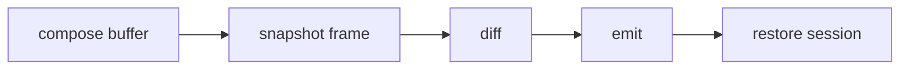

## Overview

Pure Bun cell renderer with an explicit native diff profiling boundary.

`@mwillbanks/tuil-cell` is independently installable and also participates in the
umbrella `@mwillbanks/tuil` runtime where applicable.

## Installation

```npm
npm install @mwillbanks/tuil-cell
```

## How it operates

The cell backend composes grapheme-aware buffers, preserves wide-character continuation cells, diffs frames, and emits minimal ANSI output. The TypeScript path is the default. Zig prebuilds expose an explicit conformance and profiling prototype, and applications must opt in because the prototype does not replace the complete diff and encoding workload.



## API

| API | Signature | Description |
| --- | --- | --- |
| [`Cell`](/docs/reference/packages/cell/api/cell) | `interface Cell` | Public interface Cell. |
| [`CellAccelerator`](/docs/reference/packages/cell/api/cell-accelerator) | `interface CellAccelerator` | Public interface CellAccelerator. |
| [`CellAttributes`](/docs/reference/packages/cell/api/cell-attributes) | `interface CellAttributes` | Public interface CellAttributes. |
| [`CellBuffer`](/docs/reference/packages/cell/api/cell-buffer) | `class CellBuffer` | Public class CellBuffer. |
| [`CellFrame`](/docs/reference/packages/cell/api/cell-frame) | `interface CellFrame` | Public interface CellFrame. |
| [`CellOutputMode`](/docs/reference/packages/cell/api/cell-output-mode) | `type CellOutputMode` | Public type CellOutputMode. |
| [`CellRendererBackend`](/docs/reference/packages/cell/api/cell-renderer-backend) | `class CellRendererBackend` | Public class CellRendererBackend. |
| [`CellRendererBackendOptions`](/docs/reference/packages/cell/api/cell-renderer-backend-options) | `interface CellRendererBackendOptions` | Public interface CellRendererBackendOptions. |
| [`CellSceneNode`](/docs/reference/packages/cell/api/cell-scene-node) | `interface CellSceneNode` | Public interface CellSceneNode. |
| [`CellTree`](/docs/reference/packages/cell/api/cell-tree) | `type CellTree` | Public type CellTree. |
| [`Color`](/docs/reference/packages/cell/api/color) | `type Color` | Public type Color. |
| [`composeCellScene`](/docs/reference/packages/cell/api/compose-cell-scene) | `function composeCellScene` | Public function composeCellScene. |
| [`CursorState`](/docs/reference/packages/cell/api/cursor-state) | `interface CursorState` | Public interface CursorState. |
| [`defaultColor`](/docs/reference/packages/cell/api/default-color) | `constant defaultColor` | Public constant defaultColor. |
| [`diffCellFrames`](/docs/reference/packages/cell/api/diff-cell-frames) | `function diffCellFrames` | Public function diffCellFrames. |
| [`emptyCell`](/docs/reference/packages/cell/api/empty-cell) | `constant emptyCell` | Public constant emptyCell. |
| [`encodeCellOutput`](/docs/reference/packages/cell/api/encode-cell-output) | `function encodeCellOutput` | Public function encodeCellOutput. |
| [`loadNativeCellAccelerator`](/docs/reference/packages/cell/api/load-native-cell-accelerator) | `function loadNativeCellAccelerator` | Public function loadNativeCellAccelerator. |
| [`loadOptionalCellAccelerator`](/docs/reference/packages/cell/api/load-optional-cell-accelerator) | `function loadOptionalCellAccelerator` | Public function loadOptionalCellAccelerator. |
| [`NativeCellAcceleratorOptions`](/docs/reference/packages/cell/api/native-cell-accelerator-options) | `interface NativeCellAcceleratorOptions` | Public interface NativeCellAcceleratorOptions. |
| [`typescriptCellAccelerator`](/docs/reference/packages/cell/api/typescript-cell-accelerator) | `constant typescriptCellAccelerator` | Public constant typescriptCellAccelerator. |

## Events and lifecycle

The backend consumes renderer lifecycle and input contracts; it does not introduce an application event bus.

All subscriptions and registrations return a disposer or belong to an owning
runtime that disposes them in reverse order.

## Example

```tsx
import { CellBuffer } from "@mwillbanks/tuil-cell";

const buffer = new CellBuffer(80, 24);
buffer.write(0, 0, "Ready");
```

## Related

- [Package architecture](/docs/concepts/packages)
- [Events](/docs/concepts/events)
- [Testing](/docs/guides/testing)
