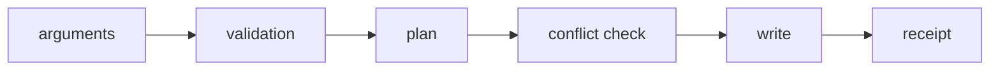

## Overview

CLI for initializing tuil applications and installing source-owned registry items and skills.

`@mwillbanks/tuil-cli` is independently installable and also participates in the
umbrella `@mwillbanks/tuil` runtime where applicable.

## Installation

```npm
npm install @mwillbanks/tuil-cli
```

## How it operates

The CLI validates configuration, resolves registry dependency graphs, plans every write, and only then applies source-owned files. Initializers and installers share the same conflict-safe transaction boundary.



## API

| Export | Kind | Source |
| --- | --- | --- |
| `InitAnswers` | export | `packages/cli/src/index.tsx` |
| `InitWizard` | export | `packages/cli/src/index.tsx` |
| `installBundledSkills` | function | `packages/cli/src/index.tsx` |
| `main` | function | `packages/cli/src/index.tsx` |
| `RegistryItem` | export | `packages/cli/src/index.tsx` |
| `RegistryItemType` | export | `packages/cli/src/index.tsx` |

## Events and lifecycle

The CLI does not publish runtime events. It reports deterministic command results and actionable errors to the invoking process.

All subscriptions and registrations return a disposer or belong to an owning
runtime that disposes them in reverse order.

## Example

```tsx
npx @mwillbanks/tuil create my-terminal-app
```

## Related

- [Package architecture](/docs/concepts/packages)
- [Events](/docs/concepts/events)
- [Testing](/docs/guides/testing)
