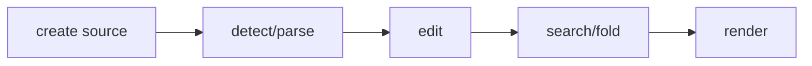

## Overview

Incremental parser-pluggable code highlighting and terminal code view models for tuil.

`@mwillbanks/tuil-code` is independently installable and also participates in the
umbrella `@mwillbanks/tuil` runtime where applicable.

## Installation

```npm
npm install @mwillbanks/tuil-code
```

## How it operates

Code documents detect languages, parse through pluggable parsers, apply incremental edits, and project tokens, diagnostics, folds, search results, and terminal lines.



## API

| Export | Kind | Source |
| --- | --- | --- |
| `CodeDiagnostic` | interface | `packages/code/src/index.ts` |
| `CodeParser` | interface | `packages/code/src/index.ts` |
| `CodeParseResult` | interface | `packages/code/src/index.ts` |
| `CodeSpan` | interface | `packages/code/src/index.ts` |
| `CodeTheme` | interface | `packages/code/src/index.ts` |
| `createBundledCodeParsers` | function | `packages/code/src/index.ts` |
| `detectCodeLanguage` | function | `packages/code/src/index.ts` |
| `IncrementalSyntaxEngine` | interface | `packages/code/src/index.ts` |
| `IncrementalSyntaxNode` | interface | `packages/code/src/index.ts` |
| `IncrementalSyntaxTree` | interface | `packages/code/src/index.ts` |
| `RegexCodeParser` | class | `packages/code/src/index.ts` |
| `TreeSitterCodeParser` | class | `packages/code/src/index.ts` |

## Events and lifecycle

Parsing and projection are explicit async operations with cancellation rather than global events.

All subscriptions and registrations return a disposer or belong to an owning
runtime that disposes them in reverse order.

## Example

```tsx
const document = new CodeDocument("const ready = true");
await document.parse(signal);
```

## Related

- [Package architecture](/docs/concepts/packages)
- [Events](/docs/concepts/events)
- [Testing](/docs/guides/testing)
