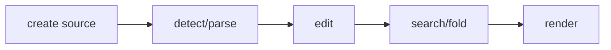

## Overview

Incremental parser-pluggable code highlighting and terminal code view models for tuil.

`@mwillbanks/tuil-code` is independently installable and also participates in the
umbrella `@mwillbanks/tuil` runtime where applicable.

## Installation

```npm
npm install @mwillbanks/tuil-code
```

## How it operates

Code documents detect languages, parse through pluggable parsers, apply incremental edits, and project tokens, diagnostics, folds, search results, and terminal lines.



## API

| API | Signature | Description |
| --- | --- | --- |
| [`CodeDiagnostic`](/docs/reference/packages/code/api/code-diagnostic) | `interface CodeDiagnostic` | Public interface CodeDiagnostic. |
| [`CodeParser`](/docs/reference/packages/code/api/code-parser) | `interface CodeParser` | Public interface CodeParser. |
| [`CodeParseResult`](/docs/reference/packages/code/api/code-parse-result) | `interface CodeParseResult` | Public interface CodeParseResult. |
| [`CodeSpan`](/docs/reference/packages/code/api/code-span) | `interface CodeSpan` | Public interface CodeSpan. |
| [`CodeTheme`](/docs/reference/packages/code/api/code-theme) | `interface CodeTheme` | Public interface CodeTheme. |
| [`createBundledCodeParsers`](/docs/reference/packages/code/api/create-bundled-code-parsers) | `function createBundledCodeParsers` | Public function createBundledCodeParsers. |
| [`detectCodeLanguage`](/docs/reference/packages/code/api/detect-code-language) | `function detectCodeLanguage` | Public function detectCodeLanguage. |
| [`IncrementalSyntaxEngine`](/docs/reference/packages/code/api/incremental-syntax-engine) | `interface IncrementalSyntaxEngine` | Public interface IncrementalSyntaxEngine. |
| [`IncrementalSyntaxNode`](/docs/reference/packages/code/api/incremental-syntax-node) | `interface IncrementalSyntaxNode` | Public interface IncrementalSyntaxNode. |
| [`IncrementalSyntaxTree`](/docs/reference/packages/code/api/incremental-syntax-tree) | `interface IncrementalSyntaxTree` | Public interface IncrementalSyntaxTree. |
| [`RegexCodeParser`](/docs/reference/packages/code/api/regex-code-parser) | `class RegexCodeParser` | Public class RegexCodeParser. |
| [`TreeSitterCodeParser`](/docs/reference/packages/code/api/tree-sitter-code-parser) | `class TreeSitterCodeParser` | Public class TreeSitterCodeParser. |

## Events and lifecycle

Parsing and projection are explicit async operations with cancellation rather than global events.

All subscriptions and registrations return a disposer or belong to an owning
runtime that disposes them in reverse order.

## Example

```tsx
const document = new CodeDocument("const ready = true");
await document.parse(signal);
```

## Related

- [Package architecture](/docs/concepts/packages)
- [Events](/docs/concepts/events)
- [Testing](/docs/guides/testing)
