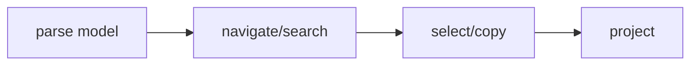

## Overview

Shared Markdown code diff JSON structured-content projections and selection models for tuil.

`@mwillbanks/tuil-content` is independently installable and also participates in the
umbrella `@mwillbanks/tuil` runtime where applicable.

## Installation

```npm
npm install @mwillbanks/tuil-content
```

## How it operates

Content models retain structured paths and diff source positions while exposing raw, tree, table, unified, and split projections.



## API

| API | Signature | Description |
| --- | --- | --- |
| [`resolveJsonPath`](/docs/reference/packages/content/api/resolve-json-path) | `function resolveJsonPath` | Public function resolveJsonPath. |
| [`StructuredContentModel`](/docs/reference/packages/content/api/structured-content-model) | `class StructuredContentModel` | Public class StructuredContentModel. |
| [`TreeRow`](/docs/reference/packages/content/api/tree-row) | `interface TreeRow` | Public interface TreeRow. |

## Events and lifecycle

Models are deterministic values and expose results directly without global events.

All subscriptions and registrations return a disposer or belong to an owning
runtime that disposes them in reverse order.

## Example

```tsx
import { StructuredContentModel } from "@mwillbanks/tuil-content";

const model = new StructuredContentModel({ service: { ready: true } });
```

## Related

- [Package architecture](/docs/concepts/packages)
- [Events](/docs/concepts/events)
- [Testing](/docs/guides/testing)
