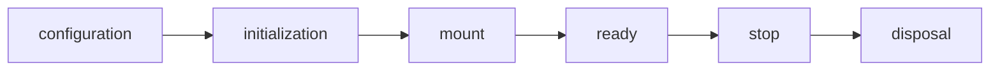

## Overview

Core runtime, lifecycle, capability, command, semantic, and terminal contracts for tuil.

`@mwillbanks/tuil-core` is independently installable and also participates in the
umbrella `@mwillbanks/tuil` runtime where applicable.

## Installation

```npm
npm install @mwillbanks/tuil-core
```

## How it operates

Core owns the framework-neutral contracts used by every adapter: lifecycle stages, services, commands, terminal capabilities, semantic metadata, disposables, and render-mode resolution.



## API

| API | Signature | Description |
| --- | --- | --- |
| [`AppLifecycleState`](/docs/reference/packages/core/api/app-lifecycle-state) | `type AppLifecycleState` | Public type AppLifecycleState. |
| [`ColorDepth`](/docs/reference/packages/core/api/color-depth) | `type ColorDepth` | Public type ColorDepth. |
| [`Command`](/docs/reference/packages/core/api/command) | `interface Command` | Public interface Command. |
| [`CommandContext`](/docs/reference/packages/core/api/command-context) | `interface CommandContext` | Public interface CommandContext. |
| [`CommandExecution`](/docs/reference/packages/core/api/command-execution) | `interface CommandExecution` | Public interface CommandExecution. |
| [`CommandRegistry`](/docs/reference/packages/core/api/command-registry) | `class CommandRegistry` | Public class CommandRegistry. |
| [`CommandRegistryChange`](/docs/reference/packages/core/api/command-registry-change) | `type CommandRegistryChange` | Public type CommandRegistryChange. |
| [`createGlobalSearchExpression`](/docs/reference/packages/core/api/create-global-search-expression) | `function createGlobalSearchExpression` | Public function createGlobalSearchExpression. |
| [`defineCommand`](/docs/reference/packages/core/api/define-command) | `function defineCommand` | Public function defineCommand. |
| [`defineService`](/docs/reference/packages/core/api/define-service) | `function defineService` | Public function defineService. |
| [`deleteOnDispose`](/docs/reference/packages/core/api/delete-on-dispose) | `function deleteOnDispose` | Public function deleteOnDispose. |
| [`detectTerminalCapabilities`](/docs/reference/packages/core/api/detect-terminal-capabilities) | `function detectTerminalCapabilities` | Public function detectTerminalCapabilities. |
| [`Disposable`](/docs/reference/packages/core/api/disposable) | `interface Disposable` | Public interface Disposable. |
| [`DisposableStack`](/docs/reference/packages/core/api/disposable-stack) | `class DisposableStack` | Public class DisposableStack. |
| [`Disposer`](/docs/reference/packages/core/api/disposer) | `type Disposer` | Public type Disposer. |
| [`escapeTerminalControlCharacters`](/docs/reference/packages/core/api/escape-terminal-control-characters) | `function escapeTerminalControlCharacters` | Public function escapeTerminalControlCharacters. |
| [`hasTerminalControlCharacters`](/docs/reference/packages/core/api/has-terminal-control-characters) | `function hasTerminalControlCharacters` | Public function hasTerminalControlCharacters. |
| [`isSafeRegularExpressionSource`](/docs/reference/packages/core/api/is-safe-regular-expression-source) | `function isSafeRegularExpressionSource` | Public function isSafeRegularExpressionSource. |
| [`Lifecycle`](/docs/reference/packages/core/api/lifecycle) | `class Lifecycle` | Public class Lifecycle. |
| [`RenderMode`](/docs/reference/packages/core/api/render-mode) | `type RenderMode` | Public type RenderMode. |
| [`resolveRenderMode`](/docs/reference/packages/core/api/resolve-render-mode) | `function resolveRenderMode` | Public function resolveRenderMode. |
| [`resolveTerminalViewport`](/docs/reference/packages/core/api/resolve-terminal-viewport) | `function resolveTerminalViewport` | Public function resolveTerminalViewport. |
| [`SemanticMetadata`](/docs/reference/packages/core/api/semantic-metadata) | `interface SemanticMetadata` | Public interface SemanticMetadata. |
| [`SemanticRole`](/docs/reference/packages/core/api/semantic-role) | `type SemanticRole` | Public type SemanticRole. |
| [`ServiceContainer`](/docs/reference/packages/core/api/service-container) | `class ServiceContainer` | Public class ServiceContainer. |
| [`ServiceDefinition`](/docs/reference/packages/core/api/service-definition) | `interface ServiceDefinition` | Public interface ServiceDefinition. |
| [`ServiceFactoryContext`](/docs/reference/packages/core/api/service-factory-context) | `interface ServiceFactoryContext` | Public interface ServiceFactoryContext. |
| [`ServiceMap`](/docs/reference/packages/core/api/service-map) | `type ServiceMap` | Public type ServiceMap. |
| [`sliceTerminalText`](/docs/reference/packages/core/api/slice-terminal-text) | `function sliceTerminalText` | Public function sliceTerminalText. |
| [`TerminalBounds`](/docs/reference/packages/core/api/terminal-bounds) | `interface TerminalBounds` | Public interface TerminalBounds. |
| [`TerminalCapabilities`](/docs/reference/packages/core/api/terminal-capabilities) | `interface TerminalCapabilities` | Public interface TerminalCapabilities. |
| [`TerminalCapabilityInput`](/docs/reference/packages/core/api/terminal-capability-input) | `interface TerminalCapabilityInput` | Public interface TerminalCapabilityInput. |
| [`TerminalInputProbe`](/docs/reference/packages/core/api/terminal-input-probe) | `interface TerminalInputProbe` | Public interface TerminalInputProbe. |
| [`TerminalOutputProbe`](/docs/reference/packages/core/api/terminal-output-probe) | `interface TerminalOutputProbe` | Public interface TerminalOutputProbe. |
| [`TerminalPlatform`](/docs/reference/packages/core/api/terminal-platform) | `type TerminalPlatform` | Public type TerminalPlatform. |
| [`terminalTextWidth`](/docs/reference/packages/core/api/terminal-text-width) | `function terminalTextWidth` | Public function terminalTextWidth. |
| [`TerminalViewport`](/docs/reference/packages/core/api/terminal-viewport) | `type TerminalViewport` | Public type TerminalViewport. |
| [`terminalViewportBreakpoints`](/docs/reference/packages/core/api/terminal-viewport-breakpoints) | `constant terminalViewportBreakpoints` | Public constant terminalViewportBreakpoints. |
| [`toDisposable`](/docs/reference/packages/core/api/to-disposable) | `function toDisposable` | Public function toDisposable. |
| [`truncateTerminalText`](/docs/reference/packages/core/api/truncate-terminal-text) | `function truncateTerminalText` | Public function truncateTerminalText. |
| [`wrapTerminalText`](/docs/reference/packages/core/api/wrap-terminal-text) | `function wrapTerminalText` | Public function wrapTerminalText. |

## Events and lifecycle

Core defines lifecycle state but does not own the event transport. The umbrella runtime projects lifecycle transitions onto `app:*` events.

All subscriptions and registrations return a disposer or belong to an owning
runtime that disposes them in reverse order.

## Example

```tsx
import { Lifecycle } from "@mwillbanks/tuil-core";

const lifecycle = new Lifecycle();
await lifecycle.transition("initializing");
```

## Related

- [Package architecture](/docs/concepts/packages)
- [Events](/docs/concepts/events)
- [Testing](/docs/guides/testing)
