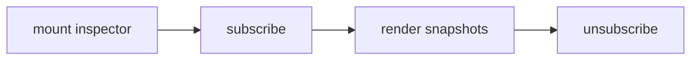

## Overview

Runtime inspector and developer overlay for tuil applications.

`@mwillbanks/tuil-devtools` is independently installable and also participates in the
umbrella `@mwillbanks/tuil` runtime where applicable.

## Installation

```npm
npm install @mwillbanks/tuil-devtools
```

## How it operates

Devtools subscribes to runtime snapshots without changing application state. The overlay exposes lifecycle, focus, services, commands, plugins, events, capabilities, and theme information.



## API

| Export | Kind | Source |
| --- | --- | --- |
| `DevtoolsPanel` | type | `packages/devtools/src/index.tsx` |
| `devtoolsPanels` | constant | `packages/devtools/src/index.tsx` |
| `DevtoolsStore` | class | `packages/devtools/src/index.tsx` |
| `inspectRuntime` | function | `packages/devtools/src/index.tsx` |
| `RuntimeInspection` | interface | `packages/devtools/src/index.tsx` |
| `TuilDevtools` | constant | `packages/devtools/src/index.tsx` |
| `TuilDevtoolsProps` | interface | `packages/devtools/src/index.tsx` |

## Events and lifecycle

Reads the runtime event history and observer stream. It does not emit application events.

All subscriptions and registrations return a disposer or belong to an owning
runtime that disposes them in reverse order.

## Example

```tsx
render(<TuilDevtools />);
```

## Related

- [Package architecture](/docs/concepts/packages)
- [Events](/docs/concepts/events)
- [Testing](/docs/guides/testing)
