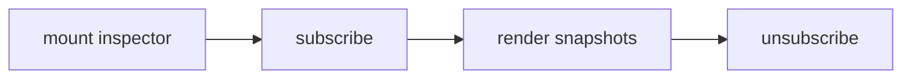

## Overview

Runtime inspector and developer overlay for tuil applications.

`@mwillbanks/tuil-devtools` is independently installable and also participates in the
umbrella `@mwillbanks/tuil` runtime where applicable.

## Installation

```npm
npm install @mwillbanks/tuil-devtools
```

## How it operates

Devtools subscribes to runtime snapshots without changing application state. The overlay exposes lifecycle, focus, services, commands, plugins, events, capabilities, and theme information.



## API

| API | Signature | Description |
| --- | --- | --- |
| [`DevtoolsActionContext`](/docs/reference/packages/devtools/api/devtools-action-context) | `interface DevtoolsActionContext` | Public interface DevtoolsActionContext. |
| [`DevtoolsActionContribution`](/docs/reference/packages/devtools/api/devtools-action-contribution) | `interface DevtoolsActionContribution` | Public interface DevtoolsActionContribution. |
| [`DevtoolsActionHistorySnapshot`](/docs/reference/packages/devtools/api/devtools-action-history-snapshot) | `interface DevtoolsActionHistorySnapshot` | Public interface DevtoolsActionHistorySnapshot. |
| [`DevtoolsActionRecord`](/docs/reference/packages/devtools/api/devtools-action-record) | `interface DevtoolsActionRecord` | Public interface DevtoolsActionRecord. |
| [`DevtoolsCapability`](/docs/reference/packages/devtools/api/devtools-capability) | `type DevtoolsCapability` | Public type DevtoolsCapability. |
| [`DevtoolsContribution`](/docs/reference/packages/devtools/api/devtools-contribution) | `interface DevtoolsContribution` | Public interface DevtoolsContribution. |
| [`DevtoolsExtension`](/docs/reference/packages/devtools/api/devtools-extension) | `type DevtoolsExtension` | Public type DevtoolsExtension. |
| [`DevtoolsExtensionRegistry`](/docs/reference/packages/devtools/api/devtools-extension-registry) | `class DevtoolsExtensionRegistry` | Public class DevtoolsExtensionRegistry. |
| [`DevtoolsObserverContribution`](/docs/reference/packages/devtools/api/devtools-observer-contribution) | `interface DevtoolsObserverContribution` | Public interface DevtoolsObserverContribution. |
| [`DevtoolsObserverKind`](/docs/reference/packages/devtools/api/devtools-observer-kind) | `type DevtoolsObserverKind` | Public type DevtoolsObserverKind. |
| [`DevtoolsPanel`](/docs/reference/packages/devtools/api/devtools-panel) | `type DevtoolsPanel` | Public type DevtoolsPanel. |
| [`DevtoolsPanelContribution`](/docs/reference/packages/devtools/api/devtools-panel-contribution) | `interface DevtoolsPanelContribution` | Public interface DevtoolsPanelContribution. |
| [`devtoolsPanels`](/docs/reference/packages/devtools/api/devtools-panels) | `constant devtoolsPanels` | Public constant devtoolsPanels. |
| [`DevtoolsPermission`](/docs/reference/packages/devtools/api/devtools-permission) | `type DevtoolsPermission` | Public type DevtoolsPermission. |
| [`DevtoolsQueryContribution`](/docs/reference/packages/devtools/api/devtools-query-contribution) | `interface DevtoolsQueryContribution` | Public interface DevtoolsQueryContribution. |
| [`DevtoolsStore`](/docs/reference/packages/devtools/api/devtools-store) | `class DevtoolsStore` | Public class DevtoolsStore. |
| [`inspectRuntime`](/docs/reference/packages/devtools/api/inspect-runtime) | `function inspectRuntime` | Public function inspectRuntime. |
| [`RuntimeInspection`](/docs/reference/packages/devtools/api/runtime-inspection) | `interface RuntimeInspection` | Public interface RuntimeInspection. |
| [`TuilDevtools`](/docs/reference/packages/devtools/api/tuil-devtools) | `constant TuilDevtools` | Public constant TuilDevtools. |
| [`TuilDevtoolsProps`](/docs/reference/packages/devtools/api/tuil-devtools-props) | `interface TuilDevtoolsProps` | Public interface TuilDevtoolsProps. |

## Events and lifecycle

Reads the runtime event history and observer stream. It does not emit application events.

All subscriptions and registrations return a disposer or belong to an owning
runtime that disposes them in reverse order.

## Example

```tsx
import { TuilDevtools } from "@mwillbanks/tuil-devtools";

render(<TuilDevtools />);
```

## Related

- [Package architecture](/docs/concepts/packages)
- [Events](/docs/concepts/events)
- [Testing](/docs/guides/testing)
