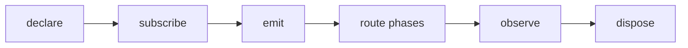

## Overview

Typed observable events and lifecycle signals for tuil applications.

`@mwillbanks/tuil-events` is independently installable and also participates in the
umbrella `@mwillbanks/tuil` runtime where applicable.

## Installation

```npm
npm install @mwillbanks/tuil-events
```

## How it operates

The typed event bus validates declared event names, schedules by priority, supports capture/target/bubble routing, redacts observed payloads, and keeps a bounded diagnostic history.



## API

| Export | Kind | Source |
| --- | --- | --- |
| `defineEvents` | function | `packages/events/src/index.ts` |
| `event` | function | `packages/events/src/index.ts` |
| `EventBus` | class | `packages/events/src/index.ts` |
| `EventDefinition` | interface | `packages/events/src/index.ts` |
| `EventDefinitions` | type | `packages/events/src/index.ts` |
| `EventEmitOptions` | interface | `packages/events/src/index.ts` |
| `EventMap` | type | `packages/events/src/index.ts` |
| `EventPhase` | type | `packages/events/src/index.ts` |
| `EventPriority` | type | `packages/events/src/index.ts` |
| `EventSource` | interface | `packages/events/src/index.ts` |
| `EventSubscriptionOptions` | interface | `packages/events/src/index.ts` |
| `EventTarget` | interface | `packages/events/src/index.ts` |
| `ObservedEvent` | interface | `packages/events/src/index.ts` |
| `TuilEvent` | interface | `packages/events/src/index.ts` |

## Events and lifecycle

`EventBus.emit()` produces `TuilEvent` objects with source, target, metadata, priority, phase, cancellation, and propagation controls.

All subscriptions and registrations return a disposer or belong to an owning
runtime that disposes them in reverse order.

## Example

```tsx
const events = new EventBus(defineEvents({ "build:done": event<{ id: string }>() }));
await events.emit("build:done", { id: "42" });
```

## Related

- [Package architecture](/docs/concepts/packages)
- [Events](/docs/concepts/events)
- [Testing](/docs/guides/testing)
