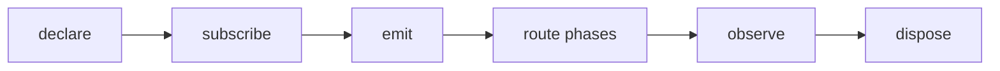

## Overview

Typed observable events and lifecycle signals for tuil applications.

`@mwillbanks/tuil-events` is independently installable and also participates in the
umbrella `@mwillbanks/tuil` runtime where applicable.

## Installation

```npm
npm install @mwillbanks/tuil-events
```

## How it operates

The typed event bus validates declared event names, schedules by priority, supports capture/target/bubble routing, redacts observed payloads, and keeps a bounded diagnostic history.



## API

| API | Signature | Description |
| --- | --- | --- |
| [`defineEvents`](/docs/reference/packages/events/api/define-events) | `function defineEvents` | Public function defineEvents. |
| [`event`](/docs/reference/packages/events/api/event) | `function event` | Public function event. |
| [`EventBus`](/docs/reference/packages/events/api/event-bus) | `class EventBus` | Public class EventBus. |
| [`EventDefinition`](/docs/reference/packages/events/api/event-definition) | `interface EventDefinition` | Public interface EventDefinition. |
| [`EventDefinitions`](/docs/reference/packages/events/api/event-definitions) | `type EventDefinitions` | Public type EventDefinitions. |
| [`EventEmitOptions`](/docs/reference/packages/events/api/event-emit-options) | `interface EventEmitOptions` | Public interface EventEmitOptions. |
| [`EventMap`](/docs/reference/packages/events/api/event-map) | `type EventMap` | Public type EventMap. |
| [`EventPhase`](/docs/reference/packages/events/api/event-phase) | `type EventPhase` | Public type EventPhase. |
| [`EventPriority`](/docs/reference/packages/events/api/event-priority) | `type EventPriority` | Public type EventPriority. |
| [`EventSource`](/docs/reference/packages/events/api/event-source) | `interface EventSource` | Public interface EventSource. |
| [`EventSubscriptionOptions`](/docs/reference/packages/events/api/event-subscription-options) | `interface EventSubscriptionOptions` | Public interface EventSubscriptionOptions. |
| [`EventTarget`](/docs/reference/packages/events/api/event-target) | `interface EventTarget` | Public interface EventTarget. |
| [`ObservedEvent`](/docs/reference/packages/events/api/observed-event) | `interface ObservedEvent` | Public interface ObservedEvent. |
| [`TuilEvent`](/docs/reference/packages/events/api/tuil-event) | `interface TuilEvent` | Public interface TuilEvent. |

## Events and lifecycle

`EventBus.emit()` produces `TuilEvent` objects with source, target, metadata, priority, phase, cancellation, and propagation controls.

All subscriptions and registrations return a disposer or belong to an owning
runtime that disposes them in reverse order.

## Example

```tsx
import { defineEvents, event, EventBus } from "@mwillbanks/tuil-events";

const events = new EventBus(defineEvents({ "build:done": event<{ id: string }>() }));
await events.emit("build:done", { id: "42" });
```

## Related

- [Package architecture](/docs/concepts/packages)
- [Events](/docs/concepts/events)
- [Testing](/docs/guides/testing)
