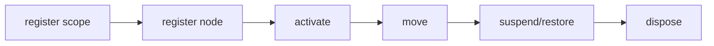

## Overview

Deterministic focus scopes, traversal, and restoration for terminal interfaces.

`@mwillbanks/tuil-focus` is independently installable and also participates in the
umbrella `@mwillbanks/tuil` runtime where applicable.

## Installation

```npm
npm install @mwillbanks/tuil-focus
```

## How it operates

Focus scopes register semantic targets, order traversal deterministically, support directional movement, suspend or restore nested scopes, and expose an observable snapshot.



## API

| Export | Kind | Source |
| --- | --- | --- |
| `FocusChange` | interface | `packages/focus/src/index.ts` |
| `FocusDirection` | type | `packages/focus/src/index.ts` |
| `FocusManager` | class | `packages/focus/src/index.ts` |
| `FocusNode` | interface | `packages/focus/src/index.ts` |
| `FocusNodeInput` | type | `packages/focus/src/index.ts` |
| `FocusProvider` | function | `packages/focus/src/index.ts` |
| `FocusScope` | function | `packages/focus/src/index.ts` |
| `FocusScopeDefinition` | interface | `packages/focus/src/index.ts` |
| `FocusTrap` | function | `packages/focus/src/index.ts` |
| `useFocusable` | function | `packages/focus/src/index.ts` |
| `useFocusManager` | function | `packages/focus/src/index.ts` |
| `useFocusScopeId` | function | `packages/focus/src/index.ts` |

## Events and lifecycle

Focus changes are exposed through subscriptions; components use them with `useSyncExternalStore` rather than a separate event name.

All subscriptions and registrations return a disposer or belong to an owning
runtime that disposes them in reverse order.

## Example

```tsx
const focus = new FocusManager();
focus.register({ id: "save", scopeId: "dialog" });
focus.focus("save");
```

## Related

- [Package architecture](/docs/concepts/packages)
- [Events](/docs/concepts/events)
- [Testing](/docs/guides/testing)
