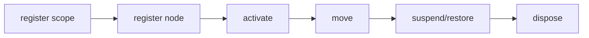

## Overview

Deterministic focus scopes, traversal, and restoration for terminal interfaces.

`@mwillbanks/tuil-focus` is independently installable and also participates in the
umbrella `@mwillbanks/tuil` runtime where applicable.

## Installation

```npm
npm install @mwillbanks/tuil-focus
```

## How it operates

Focus scopes register semantic targets, order traversal deterministically, support directional movement, suspend or restore nested scopes, and expose an observable snapshot.



## API

| API | Signature | Description |
| --- | --- | --- |
| [`FocusChange`](/docs/reference/packages/focus/api/focus-change) | `interface FocusChange` | Public interface FocusChange. |
| [`FocusDirection`](/docs/reference/packages/focus/api/focus-direction) | `type FocusDirection` | Public type FocusDirection. |
| [`FocusManager`](/docs/reference/packages/focus/api/focus-manager) | `class FocusManager` | Public class FocusManager. |
| [`FocusNode`](/docs/reference/packages/focus/api/focus-node) | `interface FocusNode` | Public interface FocusNode. |
| [`FocusNodeInput`](/docs/reference/packages/focus/api/focus-node-input) | `type FocusNodeInput` | Public type FocusNodeInput. |
| [`FocusProvider`](/docs/reference/packages/focus/api/focus-provider) | `function FocusProvider` | Public function FocusProvider. |
| [`FocusScope`](/docs/reference/packages/focus/api/focus-scope) | `function FocusScope` | Public function FocusScope. |
| [`FocusScopeDefinition`](/docs/reference/packages/focus/api/focus-scope-definition) | `interface FocusScopeDefinition` | Public interface FocusScopeDefinition. |
| [`FocusTrap`](/docs/reference/packages/focus/api/focus-trap) | `function FocusTrap` | Public function FocusTrap. |
| [`useFocusable`](/docs/reference/packages/focus/api/use-focusable) | `function useFocusable` | Public function useFocusable. |
| [`useFocusManager`](/docs/reference/packages/focus/api/use-focus-manager) | `function useFocusManager` | Public function useFocusManager. |
| [`useFocusScopeId`](/docs/reference/packages/focus/api/use-focus-scope-id) | `function useFocusScopeId` | Public function useFocusScopeId. |

## Events and lifecycle

Focus changes are exposed through subscriptions; components use them with `useSyncExternalStore` rather than a separate event name.

All subscriptions and registrations return a disposer or belong to an owning
runtime that disposes them in reverse order.

## Example

```tsx
import { FocusManager } from "@mwillbanks/tuil-focus";

const focus = new FocusManager();
focus.register({ id: "save", scopeId: "dialog" });
focus.focus("save");
```

## Related

- [Package architecture](/docs/concepts/packages)
- [Events](/docs/concepts/events)
- [Testing](/docs/guides/testing)
