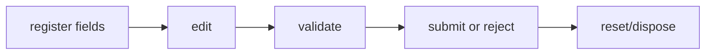

## Overview

Typed form state, validation, and controlled field adapters for tuil.

`@mwillbanks/tuil-form` is independently installable and also participates in the
umbrella `@mwillbanks/tuil` runtime where applicable.

## Installation

```npm
npm install @mwillbanks/tuil-form
```

## How it operates

Form state coordinates field registration, values, touched and dirty state, sync or async validators, submission, reset, and framework adapters.



## API

| API | Signature | Description |
| --- | --- | --- |
| [`AdaptedTanStackField`](/docs/reference/packages/form/api/adapted-tan-stack-field) | `interface AdaptedTanStackField` | Public interface AdaptedTanStackField. |
| [`adaptTanStackField`](/docs/reference/packages/form/api/adapt-tan-stack-field) | `function adaptTanStackField` | Public function adaptTanStackField. |
| [`createFormHook`](/docs/reference/packages/form/api/create-form-hook) | `export createFormHook` | Public export createFormHook. |
| [`createFormHookContexts`](/docs/reference/packages/form/api/create-form-hook-contexts) | `export createFormHookContexts` | Public export createFormHookContexts. |
| [`FieldValidator`](/docs/reference/packages/form/api/field-validator) | `type FieldValidator` | Public type FieldValidator. |
| [`FieldValidators`](/docs/reference/packages/form/api/field-validators) | `interface FieldValidators` | Public interface FieldValidators. |
| [`FormFieldRegistration`](/docs/reference/packages/form/api/form-field-registration) | `interface FormFieldRegistration` | Public interface FormFieldRegistration. |
| [`formOptions`](/docs/reference/packages/form/api/form-options) | `export formOptions` | Public export formOptions. |
| [`FormValidationError`](/docs/reference/packages/form/api/form-validation-error) | `interface FormValidationError` | Public interface FormValidationError. |
| [`TanStackFieldLike`](/docs/reference/packages/form/api/tan-stack-field-like) | `interface TanStackFieldLike` | Public interface TanStackFieldLike. |
| [`TerminalFieldBinding`](/docs/reference/packages/form/api/terminal-field-binding) | `interface TerminalFieldBinding` | Public interface TerminalFieldBinding. |
| [`TerminalFieldController`](/docs/reference/packages/form/api/terminal-field-controller) | `class TerminalFieldController` | Public class TerminalFieldController. |
| [`TerminalFieldOptions`](/docs/reference/packages/form/api/terminal-field-options) | `interface TerminalFieldOptions` | Public interface TerminalFieldOptions. |
| [`TerminalFieldState`](/docs/reference/packages/form/api/terminal-field-state) | `interface TerminalFieldState` | Public interface TerminalFieldState. |
| [`TerminalFormController`](/docs/reference/packages/form/api/terminal-form-controller) | `class TerminalFormController` | Public class TerminalFormController. |
| [`TerminalFormProvider`](/docs/reference/packages/form/api/terminal-form-provider) | `function TerminalFormProvider` | Public function TerminalFormProvider. |
| [`useForm`](/docs/reference/packages/form/api/use-form) | `export useForm` | A custom React Hook that returns an extended instance of the `FormApi` class.  This API encapsulates all the necessary functionalities related to the form. It allows you to manage form state, handle submissions, and interact with form fields |
| [`useRegisterTerminalField`](/docs/reference/packages/form/api/use-register-terminal-field) | `function useRegisterTerminalField` | Public function useRegisterTerminalField. |
| [`useStore`](/docs/reference/packages/form/api/use-store) | `export useStore` | Public export useStore. |
| [`useTerminalField`](/docs/reference/packages/form/api/use-terminal-field) | `function useTerminalField` | Public function useTerminalField. |
| [`useTerminalFormController`](/docs/reference/packages/form/api/use-terminal-form-controller) | `function useTerminalFormController` | Public function useTerminalFormController. |
| [`useTerminalFormSnapshot`](/docs/reference/packages/form/api/use-terminal-form-snapshot) | `function useTerminalFormSnapshot` | Public function useTerminalFormSnapshot. |
| [`ValidationContext`](/docs/reference/packages/form/api/validation-context) | `interface ValidationContext` | Public interface ValidationContext. |
| [`ValidationTrigger`](/docs/reference/packages/form/api/validation-trigger) | `type ValidationTrigger` | Public type ValidationTrigger. |

## Events and lifecycle

State changes are subscription-based. UI controls expose `onValueChange`, `onSubmit`, and field-level callbacks.

All subscriptions and registrations return a disposer or belong to an owning
runtime that disposes them in reverse order.

## Example

```tsx
const form = createForm({ initialValues: { name: "" }, onSubmit: async (values) => save(values) });
```

## Related

- [Package architecture](/docs/concepts/packages)
- [Events](/docs/concepts/events)
- [Testing](/docs/guides/testing)
