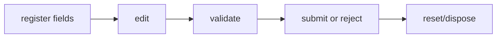

## Overview

Typed form state, validation, and controlled field adapters for tuil.

`@mwillbanks/tuil-form` is independently installable and also participates in the
umbrella `@mwillbanks/tuil` runtime where applicable.

## Installation

```npm
npm install @mwillbanks/tuil-form
```

## How it operates

Form state coordinates field registration, values, touched and dirty state, sync or async validators, submission, reset, and framework adapters.



## API

| Export | Kind | Source |
| --- | --- | --- |
| `AdaptedTanStackField` | interface | `packages/form/src/index.tsx` |
| `adaptTanStackField` | function | `packages/form/src/index.tsx` |
| `createFormHook` | export | `packages/form/src/index.tsx` |
| `createFormHookContexts` | export | `packages/form/src/index.tsx` |
| `FieldValidator` | type | `packages/form/src/index.tsx` |
| `FieldValidators` | interface | `packages/form/src/index.tsx` |
| `FormFieldRegistration` | interface | `packages/form/src/index.tsx` |
| `formOptions` | export | `packages/form/src/index.tsx` |
| `FormValidationError` | interface | `packages/form/src/index.tsx` |
| `TanStackFieldLike` | interface | `packages/form/src/index.tsx` |
| `TerminalFieldBinding` | interface | `packages/form/src/index.tsx` |
| `TerminalFieldController` | class | `packages/form/src/index.tsx` |
| `TerminalFieldOptions` | interface | `packages/form/src/index.tsx` |
| `TerminalFieldState` | interface | `packages/form/src/index.tsx` |
| `TerminalFormController` | class | `packages/form/src/index.tsx` |
| `TerminalFormProvider` | function | `packages/form/src/index.tsx` |
| `useForm` | export | `packages/form/src/index.tsx` |
| `useRegisterTerminalField` | function | `packages/form/src/index.tsx` |
| `useStore` | export | `packages/form/src/index.tsx` |
| `useTerminalField` | function | `packages/form/src/index.tsx` |
| `useTerminalFormController` | function | `packages/form/src/index.tsx` |
| `useTerminalFormSnapshot` | function | `packages/form/src/index.tsx` |
| `ValidationContext` | interface | `packages/form/src/index.tsx` |
| `ValidationTrigger` | type | `packages/form/src/index.tsx` |

## Events and lifecycle

State changes are subscription-based. UI controls expose `onValueChange`, `onSubmit`, and field-level callbacks.

All subscriptions and registrations return a disposer or belong to an owning
runtime that disposes them in reverse order.

## Example

```tsx
const form = createForm({ initialValues: { name: "" }, onSubmit: async (values) => save(values) });
```

## Related

- [Package architecture](/docs/concepts/packages)
- [Events](/docs/concepts/events)
- [Testing](/docs/guides/testing)
