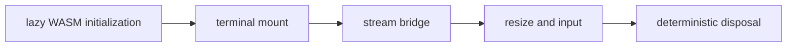

## Overview

Browser adapter that runs existing TUIL Ink applications inside Ghostty Web.

`@mwillbanks/tuil-ghostty-web` is independently installable and also participates in the
umbrella `@mwillbanks/tuil` runtime where applicable.

## Installation

```npm
npm install @mwillbanks/tuil-ghostty-web
```

## How it operates

The optional browser adapter connects the existing Ink runtime to Ghostty Web through bounded TTY streams, ordered output, input forwarding, resize events, and a semantic DOM companion.



## API

| API | Signature | Description |
| --- | --- | --- |
| [`createTuilGhosttyDocumentApp`](/docs/reference/packages/ghostty-web/api/create-tuil-ghostty-document-app) | `export createTuilGhosttyDocumentApp` | Public export createTuilGhosttyDocumentApp. |
| [`createTuilGhosttyDocumentSession`](/docs/reference/packages/ghostty-web/api/create-tuil-ghostty-document-session) | `export createTuilGhosttyDocumentSession` | Public export createTuilGhosttyDocumentSession. |
| [`createTuilGhosttyFeasibilityApp`](/docs/reference/packages/ghostty-web/api/create-tuil-ghostty-feasibility-app) | `export createTuilGhosttyFeasibilityApp` | Public export createTuilGhosttyFeasibilityApp. |
| [`createTuilGhosttyStoryApp`](/docs/reference/packages/ghostty-web/api/create-tuil-ghostty-story-app) | `function createTuilGhosttyStoryApp` | Public function createTuilGhosttyStoryApp. |
| [`generatePlaygroundTsx`](/docs/reference/packages/ghostty-web/api/generate-playground-tsx) | `export generatePlaygroundTsx` | Public export generatePlaygroundTsx. |
| [`initializeTuilGhostty`](/docs/reference/packages/ghostty-web/api/initialize-tuil-ghostty) | `function initializeTuilGhostty` | Public function initializeTuilGhostty. |
| [`mountTuilGhostty`](/docs/reference/packages/ghostty-web/api/mount-tuil-ghostty) | `function mountTuilGhostty` | Public function mountTuilGhostty. |
| [`playgroundComponentCatalog`](/docs/reference/packages/ghostty-web/api/playground-component-catalog) | `export playgroundComponentCatalog` | Public export playgroundComponentCatalog. |
| [`PlaygroundDocumentV1`](/docs/reference/packages/ghostty-web/api/playground-document-v1) | `export PlaygroundDocumentV1` | Public export PlaygroundDocumentV1. |
| [`PlaygroundNodeV1`](/docs/reference/packages/ghostty-web/api/playground-node-v1) | `export PlaygroundNodeV1` | Public export PlaygroundNodeV1. |
| [`TuilGhosttyAccessibilityOptions`](/docs/reference/packages/ghostty-web/api/tuil-ghostty-accessibility-options) | `interface TuilGhosttyAccessibilityOptions` | Public interface TuilGhosttyAccessibilityOptions. |
| [`TuilGhosttyInstance`](/docs/reference/packages/ghostty-web/api/tuil-ghostty-instance) | `interface TuilGhosttyInstance` | Public interface TuilGhosttyInstance. |
| [`TuilGhosttyMountOptions`](/docs/reference/packages/ghostty-web/api/tuil-ghostty-mount-options) | `interface TuilGhosttyMountOptions` | Public interface TuilGhosttyMountOptions. |
| [`TuilGhosttyStoryOptions`](/docs/reference/packages/ghostty-web/api/tuil-ghostty-story-options) | `interface TuilGhosttyStoryOptions` | Public interface TuilGhosttyStoryOptions. |
| [`TuilGhosttyTerminalOptions`](/docs/reference/packages/ghostty-web/api/tuil-ghostty-terminal-options) | `interface TuilGhosttyTerminalOptions` | Public interface TuilGhosttyTerminalOptions. |
| [`validatePlaygroundDocument`](/docs/reference/packages/ghostty-web/api/validate-playground-document) | `export validatePlaygroundDocument` | Public export validatePlaygroundDocument. |

## Events and lifecycle

Ghostty input enters the existing Ink input pipeline. Output and lifecycle failures reach the owning TUIL error boundary.

All subscriptions and registrations return a disposer or belong to an owning
runtime that disposes them in reverse order.

## Example

```tsx
import { mountTuilGhostty } from "@mwillbanks/tuil-ghostty-web";

const terminal = await mountTuilGhostty({ app, element });
await terminal.unmount();
```

## Related

- [Package architecture](/docs/concepts/packages)
- [Events](/docs/concepts/events)
- [Testing](/docs/guides/testing)
