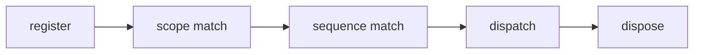

## Overview

Scoped terminal hotkeys, chords, and key sequences for tuil.

`@mwillbanks/tuil-hotkeys` is independently installable and also participates in the
umbrella `@mwillbanks/tuil` runtime where applicable.

## Installation

```npm
npm install @mwillbanks/tuil-hotkeys
```

## How it operates

Hotkey bindings normalize terminal input, match chords and sequences, honor active scopes, resolve priorities, and dispose cleanly.



## API

| API | Signature | Description |
| --- | --- | --- |
| [`Hotkey`](/docs/reference/packages/hotkeys/api/hotkey) | `function Hotkey` | Public function Hotkey. |
| [`HotkeyBinding`](/docs/reference/packages/hotkeys/api/hotkey-binding) | `interface HotkeyBinding` | Public interface HotkeyBinding. |
| [`HotkeyConflict`](/docs/reference/packages/hotkeys/api/hotkey-conflict) | `interface HotkeyConflict` | Public interface HotkeyConflict. |
| [`HotkeyDispatchContext`](/docs/reference/packages/hotkeys/api/hotkey-dispatch-context) | `interface HotkeyDispatchContext` | Public interface HotkeyDispatchContext. |
| [`HotkeyEvent`](/docs/reference/packages/hotkeys/api/hotkey-event) | `interface HotkeyEvent` | Public interface HotkeyEvent. |
| [`HotkeyLayer`](/docs/reference/packages/hotkeys/api/hotkey-layer) | `function HotkeyLayer` | Public function HotkeyLayer. |
| [`HotkeyManager`](/docs/reference/packages/hotkeys/api/hotkey-manager) | `class HotkeyManager` | Public class HotkeyManager. |
| [`HotkeyMetadata`](/docs/reference/packages/hotkeys/api/hotkey-metadata) | `interface HotkeyMetadata` | Public interface HotkeyMetadata. |
| [`HotkeyProvider`](/docs/reference/packages/hotkeys/api/hotkey-provider) | `function HotkeyProvider` | Public function HotkeyProvider. |
| [`HotkeyScope`](/docs/reference/packages/hotkeys/api/hotkey-scope) | `type HotkeyScope` | Public type HotkeyScope. |
| [`normalizeHotkeyNotation`](/docs/reference/packages/hotkeys/api/normalize-hotkey-notation) | `function normalizeHotkeyNotation` | Public function normalizeHotkeyNotation. |
| [`normalizeTerminalKey`](/docs/reference/packages/hotkeys/api/normalize-terminal-key) | `function normalizeTerminalKey` | Public function normalizeTerminalKey. |
| [`TerminalKey`](/docs/reference/packages/hotkeys/api/terminal-key) | `interface TerminalKey` | Public interface TerminalKey. |
| [`useHotkey`](/docs/reference/packages/hotkeys/api/use-hotkey) | `function useHotkey` | Public function useHotkey. |
| [`useHotkeyManager`](/docs/reference/packages/hotkeys/api/use-hotkey-manager) | `function useHotkeyManager` | Public function useHotkeyManager. |
| [`useHotkeys`](/docs/reference/packages/hotkeys/api/use-hotkeys) | `function useHotkeys` | Public function useHotkeys. |

## Events and lifecycle

Bindings invoke handlers directly. Dispatch failures are routed to the caller-supplied error handler.

All subscriptions and registrations return a disposer or belong to an owning
runtime that disposes them in reverse order.

## Example

```tsx
hotkeys.register({ keys: "ctrl+s", scope: "application", handler: save });
```

## Related

- [Package architecture](/docs/concepts/packages)
- [Events](/docs/concepts/events)
- [Testing](/docs/guides/testing)
