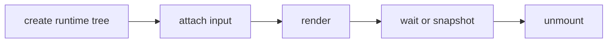

## Overview

Ink renderer, terminal input, semantics, primitives, and overlays for tuil.

`@mwillbanks/tuil-ink` is independently installable and also participates in the
umbrella `@mwillbanks/tuil` runtime where applicable.

## Installation

```npm
npm install @mwillbanks/tuil-ink
```

## How it operates

The Ink adapter composes runtime, theme, focus, hotkeys, semantics, overlays, and terminal input around Ink rendering. It supports interactive output, static output, and capability-aware fallbacks.



## API

| Export | Kind | Source |
| --- | --- | --- |
| `Alert` | function | `packages/ink/src/components.tsx` |
| `AlertProps` | interface | `packages/ink/src/components.tsx` |
| `AppBar` | function | `packages/ink/src/components.tsx` |
| `AppShell` | function | `packages/ink/src/components.tsx` |
| `Badge` | function | `packages/ink/src/components.tsx` |
| `BadgeProps` | interface | `packages/ink/src/components.tsx` |
| `Box` | function | `packages/ink/src/components.tsx` |
| `BoxProps` | interface | `packages/ink/src/components.tsx` |
| `Button` | function | `packages/ink/src/components.tsx` |
| `ButtonProps` | interface | `packages/ink/src/components.tsx` |
| `CommonComponentProps` | interface | `packages/ink/src/components.tsx` |
| `Container` | function | `packages/ink/src/components.tsx` |
| `ContainerProps` | interface | `packages/ink/src/components.tsx` |
| `createRuntimeElement` | function | `packages/ink/src/index.ts` |
| `DismissableLayer` | function | `packages/ink/src/overlay.tsx` |
| `Divider` | function | `packages/ink/src/components.tsx` |
| `DividerProps` | interface | `packages/ink/src/components.tsx` |
| `escapeTerminalControlCharacters` | export | `packages/ink/src/terminal-text.ts` |
| `ExternalSnapshotStore` | interface | `packages/ink/src/semantics.ts` |
| `Heading` | function | `packages/ink/src/components.tsx` |
| `HeadingProps` | interface | `packages/ink/src/components.tsx` |
| `HStack` | function | `packages/ink/src/components.tsx` |
| `InkRendererBackend` | class | `packages/ink/src/renderer-backend.ts` |
| `InkRendererTree` | type | `packages/ink/src/renderer-backend.ts` |
| `Overlay` | function | `packages/ink/src/overlay.tsx` |
| `OverlayProps` | interface | `packages/ink/src/overlay.tsx` |
| `OverlayProvider` | function | `packages/ink/src/overlay.tsx` |
| `OverlayStatus` | interface | `packages/ink/src/overlay.tsx` |
| `PointerEventBinding` | interface | `packages/ink/src/pointer.ts` |
| `Progress` | function | `packages/ink/src/components.tsx` |
| `ProgressProps` | interface | `packages/ink/src/components.tsx` |
| `render` | function | `packages/ink/src/index.ts` |
| `renderStatic` | function | `packages/ink/src/index.ts` |
| `renderTerminalImage` | function | `packages/ink/src/image.tsx` |
| `resolveSemanticNode` | function | `packages/ink/src/semantics.ts` |
| `ResponsiveStack` | function | `packages/ink/src/components.tsx` |
| `ResponsiveStackProps` | interface | `packages/ink/src/components.tsx` |
| `SemanticNode` | interface | `packages/ink/src/semantics.ts` |
| `SemanticProvider` | function | `packages/ink/src/semantics.ts` |
| `SemanticRegistry` | class | `packages/ink/src/semantics.ts` |
| `Spinner` | function | `packages/ink/src/components.tsx` |
| `SpinnerProps` | interface | `packages/ink/src/components.tsx` |
| `Stack` | function | `packages/ink/src/components.tsx` |
| `StackProps` | interface | `packages/ink/src/components.tsx` |
| `StatusBar` | function | `packages/ink/src/components.tsx` |
| `TerminalImage` | function | `packages/ink/src/image.tsx` |
| `TerminalImageProps` | interface | `packages/ink/src/image.tsx` |
| `TerminalImageSource` | interface | `packages/ink/src/image.tsx` |
| `TerminalInputHandler` | export | `packages/ink/src/index.ts` |
| `TerminalInputLayer` | export | `packages/ink/src/index.ts` |
| `TerminalScrollAreaOptions` | interface | `packages/ink/src/scroll.ts` |
| `TerminalSemanticNode` | function | `packages/ink/src/components.tsx` |
| `TerminalSemanticNodeProps` | interface | `packages/ink/src/components.tsx` |
| `TerminalSize` | interface | `packages/ink/src/components.tsx` |
| `Text` | function | `packages/ink/src/components.tsx` |
| `TextProps` | interface | `packages/ink/src/components.tsx` |
| `TuilRenderInstance` | interface | `packages/ink/src/index.ts` |
| `TuilRenderOptions` | interface | `packages/ink/src/index.ts` |
| `useOptionalExternalStore` | function | `packages/ink/src/semantics.ts` |
| `useOverlayStatus` | function | `packages/ink/src/overlay.tsx` |
| `usePointerCapture` | function | `packages/ink/src/pointer.ts` |
| `usePointerEvent` | function | `packages/ink/src/pointer.ts` |
| `usePointerEvents` | function | `packages/ink/src/pointer.ts` |
| `useSemanticNode` | function | `packages/ink/src/semantics.ts` |
| `useSemanticRegistry` | function | `packages/ink/src/semantics.ts` |
| `useTerminalInput` | export | `packages/ink/src/index.ts` |
| `useTerminalScrollArea` | function | `packages/ink/src/scroll.ts` |
| `useTerminalSize` | function | `packages/ink/src/components.tsx` |
| `useTerminalViewport` | function | `packages/ink/src/components.tsx` |
| `VStack` | function | `packages/ink/src/components.tsx` |

## Events and lifecycle

Input first flows through overlay handlers, scoped terminal handlers, hotkeys, then focus traversal. Application events remain on the runtime event bus.

All subscriptions and registrations return a disposer or belong to an owning
runtime that disposes them in reverse order.

## Example

```tsx
const instance = render(<App />, { app });
await instance.waitUntilExit();
```

## Related

- [Package architecture](/docs/concepts/packages)
- [Events](/docs/concepts/events)
- [Testing](/docs/guides/testing)
