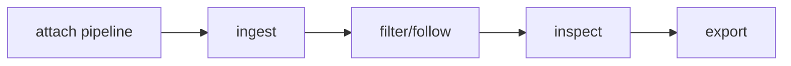

## Overview

Virtualized searchable themed log viewer models and terminal component projections for tuil.

`@mwillbanks/tuil-log-viewer` is independently installable and also participates in the
umbrella `@mwillbanks/tuil` runtime where applicable.

## Installation

```npm
npm install @mwillbanks/tuil-log-viewer
```

## How it operates

The log viewer combines normalized records, typed queries, editor input, scrolling, selection, details, timelines, tables, themes, saved searches, copy, and export.



## API

| Export | Kind | Source |
| --- | --- | --- |
| `createLogTheme` | function | `packages/log-viewer/src/index.tsx` |
| `defaultLogThemes` | constant | `packages/log-viewer/src/index.tsx` |
| `LiveIndicator` | function | `packages/log-viewer/src/index.tsx` |
| `LogDensity` | type | `packages/log-viewer/src/index.tsx` |
| `LogDetail` | function | `packages/log-viewer/src/index.tsx` |
| `LogExportDialog` | function | `packages/log-viewer/src/index.tsx` |
| `LogFacetPanel` | function | `packages/log-viewer/src/index.tsx` |
| `LogFilterBar` | function | `packages/log-viewer/src/index.tsx` |
| `LogRow` | function | `packages/log-viewer/src/index.tsx` |
| `LogRowView` | interface | `packages/log-viewer/src/index.tsx` |
| `LogSearchBar` | function | `packages/log-viewer/src/index.tsx` |
| `LogSourceBadge` | function | `packages/log-viewer/src/index.tsx` |
| `LogTheme` | interface | `packages/log-viewer/src/index.tsx` |
| `logThemeTextStyle` | function | `packages/log-viewer/src/index.tsx` |
| `LogThemeVariant` | type | `packages/log-viewer/src/index.tsx` |
| `LogTimeline` | function | `packages/log-viewer/src/index.tsx` |
| `LogViewer` | function | `packages/log-viewer/src/index.tsx` |
| `LogViewerModel` | class | `packages/log-viewer/src/index.tsx` |
| `LogViewerModelOptions` | type | `packages/log-viewer/src/index.tsx` |
| `LogViewerProps` | interface | `packages/log-viewer/src/index.tsx` |
| `ParseErrorRow` | function | `packages/log-viewer/src/index.tsx` |
| `StructuredValue` | function | `packages/log-viewer/src/index.tsx` |
| `TraceContext` | function | `packages/log-viewer/src/index.tsx` |

## Events and lifecycle

Viewer state changes are subscriptions over logging, editor, and scroll models.

All subscriptions and registrations return a disposer or belong to an owning
runtime that disposes them in reverse order.

## Example

```tsx
const viewer = new LogViewerModel(pipeline, { queryEditor: app.createEditorSession({ id: "log-query" }), queryEditorOwnership: "owned" });
```

## Related

- [Package architecture](/docs/concepts/packages)
- [Events](/docs/concepts/events)
- [Testing](/docs/guides/testing)
