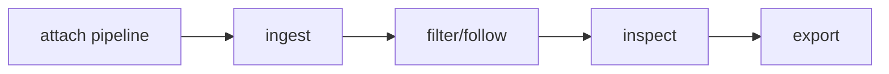

## Overview

Virtualized searchable themed log viewer models and terminal component projections for tuil.

`@mwillbanks/tuil-log-viewer` is independently installable and also participates in the
umbrella `@mwillbanks/tuil` runtime where applicable.

## Installation

```npm
npm install @mwillbanks/tuil-log-viewer
```

## How it operates

The log viewer combines normalized records, typed queries, editor input, scrolling, selection, details, timelines, tables, themes, saved searches, copy, and export.



## API

| API | Signature | Description |
| --- | --- | --- |
| [`createLogTheme`](/docs/reference/packages/log-viewer/api/create-log-theme) | `function createLogTheme` | Public function createLogTheme. |
| [`defaultLogThemes`](/docs/reference/packages/log-viewer/api/default-log-themes) | `constant defaultLogThemes` | Public constant defaultLogThemes. |
| [`LiveIndicator`](/docs/reference/packages/log-viewer/api/live-indicator) | `function LiveIndicator` | Public function LiveIndicator. |
| [`LogDensity`](/docs/reference/packages/log-viewer/api/log-density) | `type LogDensity` | Public type LogDensity. |
| [`LogDetail`](/docs/reference/packages/log-viewer/api/log-detail) | `function LogDetail` | Public function LogDetail. |
| [`LogExportDialog`](/docs/reference/packages/log-viewer/api/log-export-dialog) | `function LogExportDialog` | Public function LogExportDialog. |
| [`LogFacetPanel`](/docs/reference/packages/log-viewer/api/log-facet-panel) | `function LogFacetPanel` | Public function LogFacetPanel. |
| [`LogFilterBar`](/docs/reference/packages/log-viewer/api/log-filter-bar) | `function LogFilterBar` | Public function LogFilterBar. |
| [`LogRow`](/docs/reference/packages/log-viewer/api/log-row) | `function LogRow` | Public function LogRow. |
| [`LogRowView`](/docs/reference/packages/log-viewer/api/log-row-view) | `interface LogRowView` | Public interface LogRowView. |
| [`LogSearchBar`](/docs/reference/packages/log-viewer/api/log-search-bar) | `function LogSearchBar` | Public function LogSearchBar. |
| [`LogSourceBadge`](/docs/reference/packages/log-viewer/api/log-source-badge) | `function LogSourceBadge` | Public function LogSourceBadge. |
| [`LogTheme`](/docs/reference/packages/log-viewer/api/log-theme) | `interface LogTheme` | Public interface LogTheme. |
| [`logThemeTextStyle`](/docs/reference/packages/log-viewer/api/log-theme-text-style) | `function logThemeTextStyle` | Public function logThemeTextStyle. |
| [`LogThemeVariant`](/docs/reference/packages/log-viewer/api/log-theme-variant) | `type LogThemeVariant` | Public type LogThemeVariant. |
| [`LogTimeline`](/docs/reference/packages/log-viewer/api/log-timeline) | `function LogTimeline` | Public function LogTimeline. |
| [`LogViewer`](/docs/reference/packages/log-viewer/api/log-viewer) | `function LogViewer` | Public function LogViewer. |
| [`LogViewerModel`](/docs/reference/packages/log-viewer/api/log-viewer-model) | `class LogViewerModel` | Public class LogViewerModel. |
| [`LogViewerModelOptions`](/docs/reference/packages/log-viewer/api/log-viewer-model-options) | `type LogViewerModelOptions` | Public type LogViewerModelOptions. |
| [`LogViewerProps`](/docs/reference/packages/log-viewer/api/log-viewer-props) | `interface LogViewerProps` | Public interface LogViewerProps. |
| [`ParseErrorRow`](/docs/reference/packages/log-viewer/api/parse-error-row) | `function ParseErrorRow` | Public function ParseErrorRow. |
| [`StructuredValue`](/docs/reference/packages/log-viewer/api/structured-value) | `function StructuredValue` | Public function StructuredValue. |
| [`TraceContext`](/docs/reference/packages/log-viewer/api/trace-context) | `function TraceContext` | Public function TraceContext. |

## Events and lifecycle

Viewer state changes are subscriptions over logging, editor, and scroll models.

All subscriptions and registrations return a disposer or belong to an owning
runtime that disposes them in reverse order.

## Example

```tsx
import { LogViewerModel } from "@mwillbanks/tuil-log-viewer";

const viewer = new LogViewerModel(pipeline, { queryEditor: app.createEditorSession({ id: "log-query" }), queryEditorOwnership: "owned" });
```

## Related

- [Package architecture](/docs/concepts/packages)
- [Events](/docs/concepts/events)
- [Testing](/docs/guides/testing)
