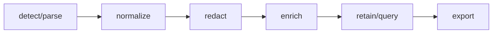

## Overview

OpenTelemetry-compatible log normalization parsers redaction indexing and query pipelines for tuil.

`@mwillbanks/tuil-logging` is independently installable and also participates in the
umbrella `@mwillbanks/tuil` runtime where applicable.

## Installation

```npm
npm install @mwillbanks/tuil-logging
```

## How it operates

Logging adapters normalize OpenTelemetry, JSON, syslog, journald, container, and text records, redact before retention, enrich, query, and export bounded data.



## API

| Export | Kind | Source |
| --- | --- | --- |
| `builtInLogParsers` | constant | `packages/logging/src/index.ts` |
| `commonLogParser` | constant | `packages/logging/src/index.ts` |
| `compileLogQuery` | function | `packages/logging/src/index.ts` |
| `containerLogParser` | constant | `packages/logging/src/index.ts` |
| `journaldParser` | constant | `packages/logging/src/index.ts` |
| `jsonLogParser` | constant | `packages/logging/src/index.ts` |
| `LogBufferStatistics` | interface | `packages/logging/src/index.ts` |
| `LogDiagnostic` | interface | `packages/logging/src/index.ts` |
| `LogEnricher` | interface | `packages/logging/src/index.ts` |
| `LogParser` | interface | `packages/logging/src/index.ts` |
| `LogPipeline` | class | `packages/logging/src/index.ts` |
| `LogRecord` | interface | `packages/logging/src/index.ts` |
| `LogRedactor` | interface | `packages/logging/src/index.ts` |
| `LogSource` | type | `packages/logging/src/index.ts` |
| `normalizeSeverity` | function | `packages/logging/src/index.ts` |
| `openTelemetryLogParser` | constant | `packages/logging/src/index.ts` |
| `processLogParser` | constant | `packages/logging/src/index.ts` |
| `syslogParser` | constant | `packages/logging/src/index.ts` |
| `textLogParser` | constant | `packages/logging/src/index.ts` |

## Events and lifecycle

Pipelines return normalized records and observable snapshots; original payloads are never exposed before redaction.

All subscriptions and registrations return a disposer or belong to an owning
runtime that disposes them in reverse order.

## Example

```tsx
const pipeline = new LogPipeline({ capacity: 100_000 });
pipeline.ingest(line);
```

## Related

- [Package architecture](/docs/concepts/packages)
- [Events](/docs/concepts/events)
- [Testing](/docs/guides/testing)
